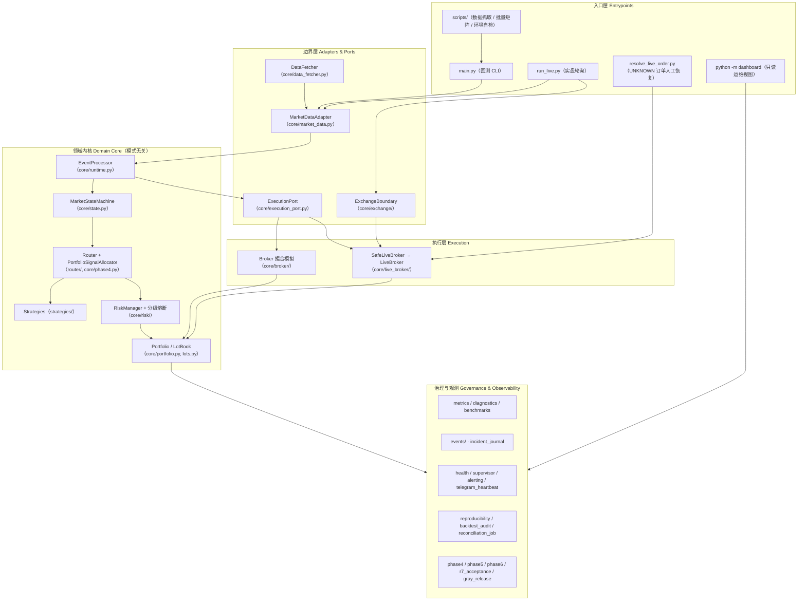
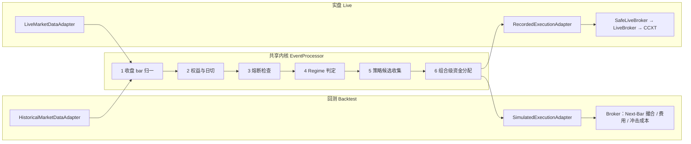
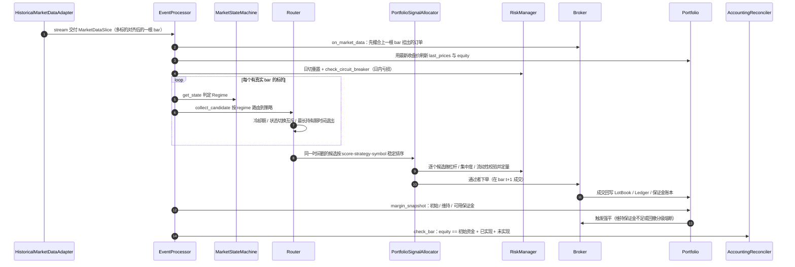
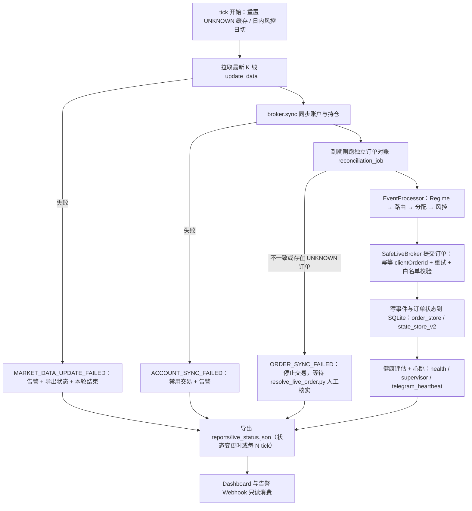
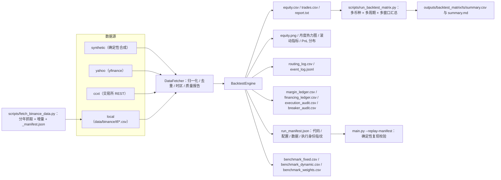

# Still Water QuantTrading

> **规范目录名**：`QuantTradingV1`。旧拼写 `QauntTradingV1` 已废弃，部署脚本与文档均不应再使用。
> Canonical repository directory: `QuantTradingV1`. The deprecated `QauntTradingV1`
> spelling must not be used by deployment scripts or documentation.
>
> **能力边界声明**：本仓库未实现任何机器学习训练或预测子系统；曾经的占位包 `models/` 已被移除。
> This repository has no machine-learning training or prediction subsystem implemented.

[](https://www.python.org/downloads/)
[]()
[](#11-测试)

---

## 目录

| 章节 | 内容 |
| --- | --- |
| [1. 概述](#1-概述) | 项目定位、适用范围 |
| [2. 项目架构](#2-项目架构) | 分层总览、端口与适配器、回测时序、实盘时序、数据与产物流、模块地图 |
| [3. 核心特性](#3-核心特性) | 引擎、状态机、路由、成本、风控、账户、归因、实盘 |
| [4. 快速开始](#4-快速开始) | 安装、回测、批量矩阵、Sandbox、Dashboard |
| [5. 命令行参考](#5-命令行参考) | `main.py` / `run_live.py` / `scripts/` / 环境变量 |
| [6. 配置](#6-配置) | `config/params.yaml` 当前生效值 |
| [7. 输出与报告](#7-输出与报告) | `reports/` 产物清单 |
| [8. 指标与诊断](#8-指标与诊断) | `core/metrics.py` / `core/diagnostics.py` |
| [9. 策略与路由现状](#9-策略与路由现状) | 已注册策略、治理状态、未接入模型 |
| [10. 能力边界](#10-能力边界) | 现货/衍生品、多标的并发、实盘准入 |
| [11. 测试](#11-测试) | 测试、文档索引、常见问题、免责声明 |

---

## 1. 概述

**Still Water QuantTrading** 是一个以「**市场状态识别（Regime）→ 策略路由（Routing）→
风险约束（Risk）→ 执行与归因（Execution & Reporting）**」为主线的 Python 量化交易研究框架。

它提供**多数据源**（Synthetic / Yahoo / CCXT / 本地缓存）、**多标的统一时间轴回测**、
**Next-Bar Execution 防前视偏差**的撮合模型，以及一个**实盘轮询引擎**
（CCXT 下单 + 状态导出 + 只读运维 Dashboard）。

项目当前处于 **Alpha** 阶段：回测链路（数据 → 状态机 → 路由 → 组合分配 → 风控 → 撮合 → 归因）
已具备工程化的正确性验证（会计恒等式核对、固定基线回归、可复现 manifest、
OOS / Walk-Forward / Bootstrap / Monte Carlo 稳健性检验）；实盘链路仍在按
`docs/unified_roadmap.md` 的 R0–R8 与 Phase 1–6 门槛逐步补齐安全冗余与运维能力。

### 适用范围

| | 说明 |
| --- | --- |
| ✅ 适用 | 策略研究、回测工程化、交易系统原型验证、Sandbox 联调 |
| ⚠️ 不适用 | 直接用于真实资金的生产级交易（需先通过 R7 验收与 Phase 6 准入证据） |

---

## 2. 项目架构

### 2.1 分层总览

系统按「**边界 → 领域内核 → 治理/观测**」分层。**回测与实盘共享同一个领域内核**，
模式差异被完全隔离在最外层的适配器里。



### 2.2 端口与适配器：一套内核，两种模式

`core/runtime.py::EventProcessor` 是「从一根已收盘 bar 到一次路由决策」的**唯一实现**。
模式差异只体现在两个端口的具体实现上：

| 抽象端口 | 回测实现 | 实盘实现 |
| --- | --- | --- |
| 行情输入 `MarketDataAdapter` | `HistoricalMarketDataAdapter`（多标的时间轴对齐 + universe 过滤） | `LiveMarketDataAdapter`（轮询拉取，只交付已收盘 bar） |
| 执行输出 `ExecutionPort` | `SimulatedExecutionAdapter` → `Broker` 撮合 | `RecordedExecutionAdapter` → `SafeLiveBroker` → CCXT |
| 驱动方式 | `BacktestEngine.run()` 一次性遍历整段历史 | `LiveTradingEngine.run()` 按 `--interval` 秒轮询 |
| 状态持久化 | 进程内 + `run_manifest.json` 快照 | SQLite（`order_store` / `state_store_v2` / `risk/persistent_guard`）+ 备份 |



### 2.3 回测：单根 bar 的确定性处理时序

`BacktestEngine.run()` 对每根 bar 严格按下列顺序推进；顺序本身就是防前视偏差与
会计一致性的保证（信号在 bar *t* 生成，订单在 bar *t+1* 撮合）。



**回撤分级熔断**（`config/params.yaml` 的 `drawdown.*`，基于权益高水位，动作具粘性）：

```text
回撤 >= 10%   reduce      仓位按 reduced_risk_multiplier 降至 50%
回撤 >= 15%   block       停止开新仓，只允许平仓
回撤 >= 20%   liquidate   全部强平
回撤 >= 25%   locked      账户锁定，需 RiskManager.manual_resume() 人工解锁
日内 >= 5%    daily       当日强平并停止交易，UTC 日切自动重置
```

### 2.4 实盘：一次 tick 的生命周期

`LiveTradingEngine._tick_once()` 是 **fail-closed** 的：任一阶段失败即导出状态、
告警并跳过本轮交易，绝不"带伤下单"。



### 2.5 数据与产物流



### 2.6 模块地图

```text
QuantTradingV1/
├── main.py                     # 回测入口：参数 → 取数 → 引擎 → 报告 → manifest
├── run_live.py                 # 实盘入口：预检 → 轮询主循环
├── resolve_live_order.py       # UNKNOWN 实盘订单的人工核实/恢复（写审计账本）
│
├── config/
│   ├── config.py               # 配置加载器（require/get 语义，缺键即报错）
│   └── params.yaml             # 执行/风控/账户/状态机/路由/Phase4-6 参数的唯一出口
│
├── core/                       # 领域内核 + 治理设施（完整清单见 docs/modules/core.md）
│   ├── ── 运行时与端口 ──
│   ├── runtime.py                    # EventProcessor：模式无关的单 bar 处理
│   ├── market_data.py                # Historical / Live 行情适配器
│   ├── execution_port.py             # 执行端口协议（Protocol）
│   ├── adapters.py / domain.py       # 共享数据契约
│   ├── system_factory.py             # 策略/风控/状态机/路由的唯一装配入口
│   │
│   ├── ── 决策与风控 ──
│   ├── state.py                      # 市场状态机（Regime）
│   ├── risk/                         # 杠杆/集中度/流动性/日内与回撤分级熔断
│   │   ├── __init__.py               #   RiskManager 门面
│   │   ├── circuit_breaker.py        #   日内亏损熔断、回撤分级粘性动作
│   │   ├── position_sizing.py        #   名义上限与数量夹取
│   │   ├── entry_policy.py           #   最终准入闸门、风控决策发布
│   │   ├── reservation.py            #   下单前资金预留，防并发超额
│   │   ├── portfolio_governor.py     #   相关性簇与组合级风险预算
│   │   └── persistent_guard.py       #   跨重启持久化风控状态
│   ├── phase4.py                     # 组合级信号分配、状态切换治理、持有期审计
│   │
│   ├── ── 账户与账本 ──
│   ├── portfolio.py                  # 组合、权益、敞口、保证金快照
│   ├── accounts.py                   # spot / spot_margin / perpetual 显式账户契约
│   ├── lots.py                       # FIFO 批次账本（lot_id / position_id / MAE-MFE）
│   ├── valuation.py                  # 组合估值快照（权威账本见 research/audit/ledger.py）
│   ├── accounting_check.py           # 逐 bar 会计恒等式核对（Gate G2）
│   │
│   ├── ── 执行 ──
│   ├── broker/                       # 回测撮合：Market/Limit/Stop、分批成交、强平
│   │   ├── __init__.py               #   Broker 门面
│   │   ├── types.py                  #   Order / OrderType / TimeInForce
│   │   ├── matching.py               #   下单、逐 bar 撮合、订单簿记账
│   │   ├── fill_service.py           #   成本核算、持仓更新、事件发布
│   │   ├── financing.py              #   永续资金费 / 融券借贷计提
│   │   ├── liquidation.py            #   强制减仓
│   │   └── cost_model.py             #   费用/滑点/冲击成本模型
│   ├── live_broker/                  # CCXT 实盘 broker
│   │   ├── __init__.py               #   LiveBroker 门面
│   │   ├── submission.py             #   下单写路径（幂等 clientOrderId）
│   │   ├── reconciler.py             #   订单状态幂等对账
│   │   ├── account_sync.py           #   余额/持仓同步
│   │   ├── safe.py                   #   幂等/限额/白名单包装层
│   │   └── retry.py                  #   交易所操作的有界重试
│   ├── exchange/                     # 交易所元数据/精度/衍生品能力的唯一边界
│   │   ├── __init__.py               #   ExchangeBoundary 门面
│   │   ├── metadata.py               #   能力探测、市场规格、元数据加载
│   │   ├── validation.py             #   下单前校验
│   │   ├── normalization.py          #   数量/价格按步长量化
│   │   ├── ccxt_mapper.py            #   canonical intent → CCXT 请求
│   │   └── parsers.py                #   CCXT 回包 → canonical 事实
│   ├── orders.py / order_store.py    # 订单模型与 SQLite 订单状态机
│   ├── clock.py                      # 统一时钟抽象
│   │
│   ├── ── 数据 ──
│   ├── data_fetcher.py / data.py     # 取数（synthetic/yahoo/ccxt/local）与质量校验
│   ├── indicators.py                 # 最小指标集（SMA/ATR/ADX/BBANDS），已验证信号路径
│   ├── factors/                      # 扩展指标库，opt-in，不自动挂载
│   │   ├── trend.py / momentum.py / volatility.py
│   │   └── volume.py / capital_flow.py / support_resistance.py
│   ├── universe.py                   # Point-in-time 成分与退市规则
│   ├── timeframes.py                 # 周期口径与年化因子推断
│   │
│   ├── ── 观测与治理 ──
│   ├── metrics.py / metric_result.py # 绩效、交易质量、归因、稳健性验证
│   ├── diagnostics.py                # 「结果该不该信」：盈亏集中度、退出归因等
│   ├── benchmarks.py                 # 固定/动态等权基准（可审计）
│   ├── events/                       # 规范事件模型、因果 ID、幂等消费与回放
│   │   ├── __init__.py               #   EventEnvelope / TradingEventPipeline 门面
│   │   ├── types.py                  #   Market/Signal/Order/Fill 等事件载荷
│   │   ├── codec.py                  #   严格 JSON 编解码与 canonical_json
│   │   ├── ids.py                    #   确定性 UUID5 事件/关联/因果 ID
│   │   └── store.py                  #   SQLite 事件持久化与回放
│   ├── event_processor.py            # 事件消费管线
│   ├── backtest_audit.py             # 强制事件日志与第二数据源校验
│   ├── reproducibility.py            # run_manifest：代码/配置/数据指纹
│   ├── health.py / supervisor.py     # 健康评估与进程守护
│   ├── alerting.py / telegram_heartbeat.py / incident_journal.py
│   ├── reconciliation_job.py         # 周期性订单与持仓对账
│   ├── sqlite_backup.py / sqlite_utils.py / state_store_v2.py
│   ├── startup_preflight.py          # 启动前自检报告
│   ├── live_safety.py                # 凭据/交易所/标的/账户类型白名单
│   ├── gray_release.py               # R8 灰度放量限额
│   ├── r7_acceptance.py              # R7 验收证据校验
│   ├── phase6.py                     # Phase 6 影子/纸面/准入门槛（fail-closed CLI）
│   └── logger.py
│
├── strategies/                 # 策略插件
│   ├── base.py                 # Strategy 基类：统一硬止损、健康度、成交消费
│   ├── trend_breakout.py       # TrendBreakoutStrategy / TrendBreakdownStrategy
│   ├── mean_reversion.py       # RangeStrategy
│   ├── volatility.py           # VolatilityReversionStrategy
│   └── statistical_arbitrage.py# PairsTradingModel（研究用，未接入路由）
│
├── router/router.py            # Regime → Strategy 路由 + 冷却期 + 候选收集
│
├── backtest/
│   ├── engine.py               # 回测主循环（bar 时序、强平、会计核对、基准）
│   ├── execution_adapter.py    # 模拟执行适配器
│   ├── market_data_adapter.py  # 历史行情适配器装配
│   ├── capacity.py             # 资金容量曲线（Phase 3）
│   └── reporting.py            # report.txt / CSV / 四联图与扩展图表
│
├── live_trading/
│   ├── engine.py               # 实盘轮询引擎（tick 生命周期、状态导出）
│   ├── execution_adapter.py    # 记录式执行适配器
│   └── market_data_adapter.py  # 实盘行情适配器装配
│
├── analysis/
│   ├── optimize.py             # 参数优化（含 --oos）
│   ├── validation.py           # walk-forward / bootstrap 验证
│   └── phase5.py               # 研究治理：数据分区、holdout 协议、多重检验
│
├── dashboard/                  # 只读运维 CLI（消费 live_status.json，不控制交易）
├── scripts/                    # 数据抓取、批量矩阵、阶段证据、环境与依赖校验
├── research/replay.py          # 事件回放研究脚本
├── data/binance/<tf>/          # 本地行情缓存（--source local 读取）
├── outputs/                    # 批量实验与阶段性产物
├── reports/                    # 回测/实盘运行产物（按时间戳分目录）
├── docs/                       # 权威文档（见文档索引）
└── tests/                      # 66 个 pytest 测试模块：基线回归、无前视、订单生命周期、各 Gate
```

---

## 3. 核心特性

- **事件驱动回测引擎**：多标的时间对齐（`union` / `intersection`）、指标预热、
  Next-Bar 执行（信号在 bar *t* 生成，订单在 bar *t+1* 撮合，杜绝前视偏差）。
- **市场状态机（Regime Detection）**：SMA 快/慢线结构 + ADX 强度过滤 + ATR% 波动扩张，
  识别 `TREND_UP / TREND_DOWN / SIDEWAYS / VOLATILE`，并以 `stability_period` 去抖动。
- **动态策略路由 + 组合级分配**：按 regime 把每根 bar 分发到对应策略；同一时间戳的多个
  候选信号由 `PortfolioSignalAllocator` 按稳定顺序（score → strategy → symbol）统一分配资金，
  消除"先到先得"的顺序依赖；并带状态切换互斥、冷却期与最长持有期时间退出。
- **成本与执行模拟**：Market / Limit / Stop 三种订单，maker/taker 双边手续费、
  固定或随机滑点、买卖价差、波动率滑点、参与率非线性冲击成本与跨 bar 分批成交。
- **风控**：杠杆上限、单标的集中度上限、单笔订单流动性约束、下单前资金预留、
  独立日内亏损限制，以及基于权益高水位的 reduce / block / liquidate / locked 分级熔断。
- **账户与保证金**：显式区分 `spot / spot_margin / perpetual`，逐 bar 对账初始/维持/可用保证金，
  支持资金费、借币费、可借限制与标记价格强平。
- **批次级账本**：每次开仓生成 `lot_id` / `position_id`，FIFO 追踪加减仓与部分成交，
  每笔平仓可精确定位其开仓批次，并记录 MAE / MFE。
- **正确性护栏**：逐 bar 会计恒等式核对、`run_manifest.json` 可复现指纹、
  `--replay-manifest` 确定性重跑校验、对头部盈亏交易的第二数据源独立核对。
- **报告、归因与诊断**：绩效/交易质量/归因/稳健性指标，加上「结果可不可信」的诊断
  （盈亏集中度、退出归因、策略 close 钩子是否真的触发）。
- **实盘轮询引擎**：fail-closed tick 流程、幂等下单、独立订单对账、健康评估与心跳、
  `reports/live_status.json` 状态导出；异常订单经 `resolve_live_order.py` 走人工审计恢复。

### 订单执行模型（`core/broker/`）

- **Market**：bar *t+1* 开盘价成交（叠加滑点）
- **Limit**：触及限价成交；开盘即可成交时按开盘价（taker），盘中触及时按限价（maker）
- **Stop**：触发后按更不利的开盘/触发价成交（taker）

更完整细节见 [`docs/backtest_assumptions.md`](docs/backtest_assumptions.md)。

---

## 4. 快速开始

### 4.1 安装依赖

```bash
python -m venv .venv
```

```bash
pip install -r requirements.txt
```

```bash
pip install -r requirements-dev.txt
```

Windows 激活虚拟环境用 `.venv\Scripts\activate`，Linux / macOS 用 `source .venv/bin/activate`。

> CI 与 `mypy` 目标 Python 版本为 **3.11**（`.github/workflows/tests.yml`、`pyproject.toml`），
> 本地开发环境固定为 3.13.2（`.python-version`）。

**核心依赖**（`requirements.txt`）：

| 库 | 版本 | 用途 |
| --- | --- | --- |
| `ccxt` | 4.5.35 | 交易所连接（数据 + 实盘下单） |
| `pandas` / `numpy` | 2.3.3 / 2.4.2 | 数据处理与指标计算 |
| `matplotlib` / `plotly` | 3.10.8 / 6.5.2 | 静态出图 / 交互式图表 |
| `streamlit` | 1.54.0 | 已声明依赖，但当前代码库中未被任何模块导入使用 |
| `PyYAML` | 6.0.3 | `config/params.yaml` 解析 |
| `requests` | 2.32.5 | HTTP 调用（如 Telegram 告警） |
| `yfinance` | 1.1.0 | Yahoo Finance 数据源 |

### 4.2 运行回测

无参数运行会打印用法并以非零状态退出（便于脚本化），不会阻塞在交互式输入上。

```bash
python main.py --source synthetic --days 365 --capital 10000 --symbols BTC-USDT ETH-USDT --seed 42
```

指定日期区间（优先级高于 `--days`）：

```bash
python main.py --source synthetic --start 2019-01-01 --end 2020-12-31 --symbols BTC-USDT ETH-USDT --seed 42
```

使用本地缓存的真实行情（先用 `scripts/fetch_binance_data.py` 下载）：

```bash
python main.py --source local --data-dir data/binance/1d --timeframe 1d --symbols BTC-USDT ETH-USDT
```

### 4.3 下载行情与批量回测矩阵

```bash
python scripts/fetch_binance_data.py --timeframes 1d 4h --symbols BTC/USDT ETH/USDT
```

```bash
python scripts/run_backtest_matrix.py --timeframes 1d --windows full
```

汇总结果写入 `outputs/backtest_matrix/<时间戳>/summary.csv` 与 `summary.md`。

### 4.4 连接交易所 Sandbox

```bash
python run_live.py --exchange binance --symbols BTC/USDT ETH/USDT --interval 60 --sandbox
```

- **API Key**：仅通过 `EXCHANGE_API_KEY` / `EXCHANGE_SECRET` 环境变量提供测试环境凭据；
  不要把密钥放入命令行、仓库或日志。
- **安全范围**：当前只进行回测和 sandbox 验证；R7 / Phase 6 准入完成前不使用真实资金，
  详见 [`docs/deployment.md`](docs/deployment.md)。
- **部署前自检**：`--preflight-only` 只连接交易所并写启动报告后退出。
- **状态导出**：每次 tick 按需写入 `reports/live_status.json`（实现见 `live_trading/engine.py`）。
  该文件**不能**替代交易所订单/持仓对账。

#### 恢复 UNKNOWN 状态的实盘订单

若某笔订单停留在 `UNKNOWN`，**先停止交易并在交易所订单历史中独立核实该订单确实不存在**，再执行：

```bash
python resolve_live_order.py CLIENT_ORDER_ID --order-store reports/live_orders.db --operator YOUR_ID --reason "verified absent at exchange" --confirm-not-submitted
```

该命令会拒绝已有交易所订单 ID 或任何成交记录的订单，把符合条件的订单迁移到
`EXPIRED_UNSUBMITTED`，并把操作人、原因、迁移前状态和时间戳写入 SQLite 审计账本。
**切勿**仅因一次查询超时或临时无结果就使用此命令。

### 4.5 只读运维 Dashboard

Dashboard 是一个最小化 CLI，消费 `live_status.json` 与近期告警记录；
它**不是** Web UI，也**从不控制交易**：

```bash
python -m dashboard --status reports/live_status.json --alerts reports/live_alerts.jsonl
```

状态快照缺失或非法时以退出码 `2` 结束。

---

## 5. 命令行参考

### 5.1 回测入口 `main.py`

| 参数 | 默认 | 说明 |
| :--- | :--- | :--- |
| `--source` | `synthetic` | 数据源：`synthetic` / `yahoo` / `ccxt` / `local` |
| `--data-dir` | — | `--source local` 的 OHLCV CSV 目录（如 `data/binance/1d`） |
| `--symbols` | `BTC-USDT ETH-USDT` | 标的列表；`ccxt` 支持 `BTC/USDT` 与 `BTC-USDT` |
| `--days` | `365` | 从当前时间向前回测 N 天（未指定 start/end 时生效） |
| `--start` / `--end` | — | 日期区间，优先级高于 `--days` |
| `--capital` | `10000.0` | 初始资金（USDT） |
| `--seed` | `42` | 随机种子（合成数据 + 随机滑点可复现） |
| `--slippage` | 取配置 `execution.slippage_bps`（5 bps） | 滑点比例（`0.001` = 0.1%） |
| `--random_slip` | `False` | 随机滑点，`[0, --slippage]` 均匀分布 |
| `--exchange` | `binance` | 行情来源的交易所身份（写入 manifest） |
| `--market-type` | 取配置 `account.mode` | `spot` / `margin` / `perpetual` |
| `--timeframe` | `1d` | Bar 周期与 manifest 身份 |
| `--data-timezone` | `UTC` | 解释请求日期边界的时区 |
| `--alignment-mode` | `union` | 多标的时间轴对齐：`union` / `intersection` |
| `--benchmark-mode` | `fixed` | 主报告基准：`fixed` 等权买入持有 / `dynamic` 等权再平衡 |
| `--benchmark-rebalance-cost-bps` | `5.0` | 动态基准的换手成本 |
| `--universe-file` | — | Point-in-time 成分表 CSV（`symbol,listed_at,delisted_at`） |
| `--secondary-data-dir` | — | 头部盈亏交易第二数据源核对用的独立 CSV 目录 |
| `--require-secondary-audit` | `False` | 第二数据源核对不通过时返回非零退出码 |
| `--replay-manifest` | — | 重跑已有 `run_manifest.json` 并比对确定性输出 |
| `--disable-routing-log` | `False` | 关闭逐 bar 路由 CSV，用于批量参数优化 |

### 5.2 实盘入口 `run_live.py`

| 参数 | 默认 | 说明 |
| :--- | :--- | :--- |
| `--symbols` | `BTC/USDT ETH/USDT` | 标的列表 |
| `--interval` | `60` | 轮询间隔（秒） |
| `--sandbox` / `--live` | `--sandbox` | 互斥组；`--live` 才连接真实资金端点 |
| `--exchange` | `binance` | CCXT 交易所 ID |
| `--market-type` | `spot` | `spot` / `future` / `futures` / `swap` / `margin`，受能力边界约束 |
| `--base-currency` | `USDT` | 计价货币 |
| `--preflight-only` | `False` | 只连接交易所、写启动报告后退出 |
| `--preflight-report` | `reports/startup_preflight.json` | 启动自检报告路径 |
| `--r8-evidence` | — | 已通过的 R7 或 Phase 6 准入证据 JSON（`--live` 必需） |
| `--rollback-snapshot` | — | 已验证的可回滚状态快照（`--live` 必需） |
| `--r8-max-order-notional` / `--r8-max-daily-risk` | — | 灰度放量阶段的单笔名义额与日风险上限 |

### 5.3 运维脚本 `scripts/`

| 脚本 | 用途 |
| --- | --- |
| `fetch_binance_data.py` | 分年抓取并增量缓存币安行情，写 `_manifest.json`（SHA-256 / 行数 / 时间范围） |
| `run_backtest_matrix.py` | 多币种 × 多周期 × 多时间窗批量回测，汇总核心指标 |
| `run_phase3_capacity.py` | 生成资金容量曲线验证报告 |
| `run_phase4_analysis.py` | 生成 Phase 4 路由/持有期/归因证据包 |
| `run_phase5_analysis.py` | 生成 Phase 5 研究治理与 OOS 验证证据包 |
| `check_environment.py` | 环境自检 |
| `verify_lock.py` | 依赖锁（`requirements.lock.txt`）校验 |

Phase 6 准入证据的 fail-closed 评估由 `python -m core.phase6` 提供。

### 5.4 环境变量

| 变量 | 用途 |
| --- | --- |
| `EXCHANGE_API_KEY` / `EXCHANGE_SECRET` / `EXCHANGE_PASSWORD` | 交易所 API 凭据（`core/live_safety.py` 只从环境变量读取） |
| `QUANT_ALLOWED_EXCHANGES` | 允许连接的交易所白名单 |
| `QUANT_ALLOWED_SYMBOLS` | 允许交易的标的白名单 |
| `QUANT_ALLOWED_ACCOUNT_TYPES` | 允许的账户/市场类型白名单 |
| `QUANT_PROXY_URL` | 代理地址，`core/data_fetcher.py` 用于设置 `HTTP_PROXY`/`HTTPS_PROXY` |
| `QUANT_LOG_LEVEL` | 日志级别 |
| `TELEGRAM_BOT_TOKEN` / `TELEGRAM_CHAT_ID` | Telegram 心跳与告警凭据 |
| `LIVE_ALERT_WEBHOOK_URL` | 实盘告警 Webhook 地址 |

以上变量均只能通过环境变量注入，**不要**写入命令行参数、仓库或日志。

---

## 6. 配置

`config/params.yaml` 是所有运行参数的唯一出口，`config.require(...)` 缺键即报错（不做静默默认）。
当前生效的关键默认值：

| 分组 | 键 | 值 |
| --- | --- | --- |
| 执行与费率 | `execution.commission_rate_taker` / `_maker` | `0.0005` / `0.0002` |
| | `execution.slippage_bps` / `spread_bps` | `5` / `2` |
| | `execution.volatility_slippage_factor` | `0.02` |
| | `execution.use_impact_cost` / `impact_coefficient` / `impact_exponent` | `true` / `0.10` / `1.5` |
| | `execution.max_participation_rate` | `0.05`（超出后跨 bar 分批成交） |
| | `execution.reconciliation_interval_seconds` | `300` |
| 风控 | `risk.max_leverage` / `risk_per_trade` | `3.0` / `0.02` |
| | `risk.max_pos_size_pct` / `liquidity_limit_pct` | `0.30` / `0.01` |
| | `drawdown.daily_loss_limit` | `0.05` |
| | `drawdown.reduce/block/liquidate/lock_threshold` | `0.10 / 0.15 / 0.20 / 0.25` |
| | `drawdown.reduced_risk_multiplier` | `0.50` |
| 账户 | `account.mode` | `spot_margin` |
| | `account.initial_margin_rate` / `maintenance_margin_rate` | `0.3333` / `0.10` |
| | `account.default_borrow_rate_annual` / `liquidation_penalty_bps` | `0.08` / `25` |
| 状态机 | `state.ma_fast` / `ma_slow` / `stability_period` | `20` / `60` / `5` |
| | `state.adx_period` / `adx_threshold` | `14` / `25` |
| | `state.atr_period` / `atr_pct_threshold` | `14` / `0.025` |
| 路由 | `routing.*` | 见[第 9 节](#9-策略与路由现状)（当前仅 `TREND_UP` 有活跃策略） |
| | `router.cooldown_bars` | `2` |
| | `phase4.max_holding_days` / `allocation_order` | `365` / `score_strategy_symbol` |
| 数据 | `data.alignment_mode` / `timeframe` / `timezone` | `union` / `1d` / `UTC` |
| 基准 | `benchmark.mode` / `dynamic_rebalance_cost_bps` | `fixed` / `5.0` |
| 回测生命周期 | `backtest.end_of_backtest_mode` | `mark_to_market` |

> 以上数值随 `config/params.yaml` 演进，如与文件内容不一致，以文件为准。

---

## 7. 输出与报告

每次回测在 `reports/` 下生成独立的时间戳目录（命名规则见 `main.py`），典型包含：

| 分类 | 文件 | 说明 |
| --- | --- | --- |
| 核心 | `report.txt` | 完整指标 + 回测元信息（控制台只打印主指标，此文件是唯一完整出口） |
| | `equity.csv` | 权益曲线（`timestamp, equity, cash`） |
| | `trades.csv` | 逐笔成交（手续费、滑点、`strategy_id`、`exit_reason`） |
| 图表 | `equity.png` | 净值 / 回撤 / 收益 / 资金占用四联图 |
| | `monthly_returns_heatmap.png` / `rolling_metrics.png` / `pnl_distribution.png` | 扩展分析图 |
| 基准 | `benchmark_fixed.csv` / `benchmark_dynamic.csv` / `benchmark_weights.csv` / `benchmark_turnover_cost.csv` / `benchmark_metadata.json` | 可审计的固定与动态等权基准 |
| 过程 | `routing_log.csv` | 每根 bar 的 regime 与路由策略 |
| | `event_log.jsonl` | 规范交易事件流（可回放） |
| 账本 | `margin_ledger.csv` / `financing_ledger.csv` | 逐 bar 保证金与融资成本 |
| | `execution_audit.csv` / `breaker_audit.csv` / `breaker_state.json` | 执行与熔断审计 |
| 质量 | `data_quality_report.json` | 缺失、重复、gap、spike 等数据质量 |
| | `top_trade_market_data_audit.json` | 头部盈亏交易的第二数据源核对 |
| 复现 | `run_manifest.json` | 代码 / 配置 / 数据 / 执行身份指纹，配合 `--replay-manifest` 校验 |

实盘侧产物：`reports/live_status.json`（状态快照）、`reports/live_alerts.jsonl`（告警）、
`reports/live_orders.db`（订单状态机与审计账本）、`reports/startup_preflight.json`（启动自检）。

---

## 8. 指标与诊断

### 8.1 绩效指标（`core/metrics.py`）

全部为纯函数（无副作用、只读输入）；公式、空值语义与边界条件的权威定义见
[`docs/glossary.md`](docs/glossary.md)。

| 类别 | 关键函数 | 覆盖内容 |
| --- | --- | --- |
| 核心绩效 | `calculate_equity_metrics` / `calculate_sharpe` / `calculate_drawdown` | CAGR、Sharpe、最大回撤（峰值/谷底/恢复时长）、月收益 |
| 回撤事件 | `calculate_drawdown_events` | 枚举每一段独立的峰→谷→恢复，而非只报最差一次 |
| 交易质量 | `calculate_trade_quality` / `calculate_profit_factor` / `calculate_r_multiple_stats` | 胜率、期望值、盈利因子（含 Bootstrap 置信区间）、R-Multiple、SQN |
| 归因与对比 | `calculate_attribution` / `calculate_benchmark_comparison` / `calculate_exposure` | 按策略/标的/月份归因、超额收益、组合敞口 |
| 稳健性验证 | `train_test_split_returns` / `walk_forward_windows` / `bootstrap_return_distribution` / `monte_carlo_trade_sequence` / `benjamini_hochberg` | OOS 切分、滚动窗口、自助法区间、蒙特卡洛重排、FDR 校正 |

年化因子由权益序列的时间间隔自动推断（`infer_periods_per_year`），因此 Sharpe / CAGR 随周期自适应；
这也是 `scripts/run_backtest_matrix.py` 能横扫多个周期的前提。

### 8.2 可信度诊断（`core/diagnostics.py`）

`metrics.py` 回答「表现如何」，`diagnostics.py` 回答一个**更前置**的问题：**这个数字该不该信、
系统是不是真在做代码声称的事**。例如盈亏集中度（少数几笔幸运交易 vs 真实边缘）、
退出归因（策略自己的退出逻辑是否真的触发）、策略 `on_trade_closed` 钩子是否静默失效。

`analysis/optimize.py --oos`、`analysis/validation.py` 与 `analysis/phase5.py`
是这套工具在参数寻优与研究治理场景下的调用入口。

---

## 9. 策略与路由现状

`core/system_factory.py` 是策略注册的唯一入口。**已注册的策略实例**：

| 策略名 | 实现类 | 文件 | 治理状态（`strategy_governance`） |
| --- | --- | --- | --- |
| `TrendBreakout` | `TrendBreakoutStrategy` | `strategies/trend_breakout.py` | `admitted` |
| `TrendBreakdown` | `TrendBreakdownStrategy` | `strategies/trend_breakout.py` | `paused_redesign` |
| `RangeMeanReversion` | `RangeStrategy` | `strategies/mean_reversion.py` | `paused_redesign` |
| `VolatilityReversion` | `VolatilityReversionStrategy` | `strategies/volatility.py` | `isolated_research` |

**当前路由映射**（`config/params.yaml` 的 `routing`）——除趋势向上外均已被置为 `Cash`；
路由到 `Cash` 表示该 regime 下不开新仓，Router 直接返回：

| Regime | 当前路由 | 说明 |
| --- | --- | --- |
| `TREND_UP` | `TrendBreakout` | 唯一活跃策略 |
| `TREND_DOWN` | `Cash` | 空头准入重新设计中（T-4.5） |
| `SIDEWAYS` | `Cash` | 区间均值回归重新设计中（T-4.6） |
| `VOLATILE` | `Cash` | 波动反转仅隔离研究（T-4.7） |

此外，当 `--market-type` 不是衍生品类型时，`build_router(allow_short=False)` 会强制把
`TREND_DOWN` 置为 `Cash`——现货账户不会被路由去做空。

所有策略继承 `strategies/base.py` 的 `Strategy` 基类，并在具体退出逻辑之前统一接受
`Strategy.hard_stop_exit` 硬止损检查。`TrendBreakoutStrategy` / `TrendBreakdownStrategy`
的健康度状态通过 `_PersistentHealthMixin` 持久化，进程重启后可恢复。

**未接入路由的模型**：`strategies/statistical_arbitrage.py` 的 `PairsTradingModel`
（跨标的配对交易信号）未在 `core/system_factory.py` 中注册，不会被 `main.py` 或
`run_live.py` 的默认路由调用，只能在测试/研究脚本中单独使用。

---

## 10. 能力边界

- **现货 vs 衍生品**：回测路径已用 `account.mode` 打通 `spot / spot_margin / perpetual`
  三种独立语义及其保证金、融资成本与强平契约。实盘入口仍受 `core/live_safety.py` 的
  账户类型白名单、交易所元数据和启动预检约束；**回测支持不等于自动批准真实资金使用**。
- **多标的并发交易**：实盘与回测引擎均原生**同时**处理多个标的，并非依次轮询触发。
  仓位按标的独立记录（`core/portfolio.py`），仓位计算基于组合整体权益，风控
  （`core/risk/`）在组合层面统一管控总杠杆与单标的集中度（默认 `max_pos_size_pct=30%`）。
  同一时间戳的多个候选信号由 `PortfolioSignalAllocator` 按确定性顺序分配资金。
  详见 [`docs/modules/core.md`](docs/modules/core.md)。
- **实盘准入**：真实资金准入需要 R7 验收证据（`core/r7_acceptance.py`）与
  Phase 6 影子/纸面运行证据（`core/phase6.py`，fail-closed：证据不存在即视为未通过），
  并在 `run_live.py --live` 时通过 `--r8-evidence` / `--rollback-snapshot` 强制校验。

---

## 11. 测试

```bash
python -m pytest -q
```

`tests/` 共 66 个测试模块，覆盖固定基线回归（`test_backtest_regression.py`）、
无前视偏差（`test_no_lookahead.py`）、订单生命周期与实盘安全（`test_g1_*` / `test_g2_*`）、
指标、执行端口与各阶段 Gate。

## 文档索引

| 文档 | 说明 |
| --- | --- |
| [`docs/README.md`](docs/README.md) | 文档入口、权威层级和历史归档说明 |
| [`docs/modules/README.md`](docs/modules/README.md) | 逐包代码说明（模块职责、关键类、模块间关系） |
| [`docs/unified_roadmap.md`](docs/unified_roadmap.md) | 唯一项目总路线图、R0–R8 与放行门槛 |
| [`docs/development_plan.md`](docs/development_plan.md) | 当前开发批次、任务顺序和验收产物 |
| [`docs/backtest_assumptions.md`](docs/backtest_assumptions.md) | 执行模型、费率/滑点、数据对齐与局限性 |
| [`docs/authoritative_ledger.md`](docs/authoritative_ledger.md) | 权威账本与会计口径 |
| [`docs/canonical_trading_events.md`](docs/canonical_trading_events.md) | 规范交易事件模型 |
| [`docs/g1_live_safety.md`](docs/g1_live_safety.md) / [`docs/g2_order_lifecycle.md`](docs/g2_order_lifecycle.md) | 实盘安全与订单生命周期门槛 |
| [`docs/deployment.md`](docs/deployment.md) / [`docs/r6_operations.md`](docs/r6_operations.md) / [`docs/r7_sandbox_runbook.md`](docs/r7_sandbox_runbook.md) | 部署、运维与 sandbox 手册 |
| [`docs/phase6_operations.md`](docs/phase6_operations.md) | Phase 6 影子/纸面/准入运营流程 |
| [`docs/glossary.md`](docs/glossary.md) | 中英文词汇表与计算口径 |

## 常见问题（FAQ）

- **CCXT / Yahoo 拉数失败**：`core/data_fetcher.py` 的 `DataFetcher` 会从 `QUANT_PROXY_URL`
  读取代理地址并设置 `HTTP_PROXY` / `HTTPS_PROXY`；未设置时不使用代理。若需要代理但仍失败，
  检查 `QUANT_PROXY_URL` 是否正确指向本机代理端口，也可在构造 `DataFetcher(...)` 时用
  `proxy_url=` 显式覆盖。
- **高频周期数据下不全**：`fetch_ccxt` 单次有 10000 根 K 线的安全上限；请改用
  `scripts/fetch_binance_data.py`（分年分块 + 增量）落到本地，再用 `--source local` 回测。
- **多标的无公共时间轴**：默认 `--alignment-mode union`，只路由当根 bar 真实存在的标的；
  改为 `intersection` 则要求所有标的都有 bar。日线或更慢周期会尝试按日历日期退化对齐
  （见 `backtest/engine.py`）。
- **控制台中文乱码**：Windows 控制台代码页通常是 GBK，因此控制台只打印主指标，
  完整中文报告写入 UTF-8 的 `report.txt`。

## 免责声明

本项目仅用于研究、教学与工程演示；不构成投资建议。数字资产与衍生品交易风险极高，
可能导致全部损失。实盘部署前请自行补齐安全、风控与运维能力。
