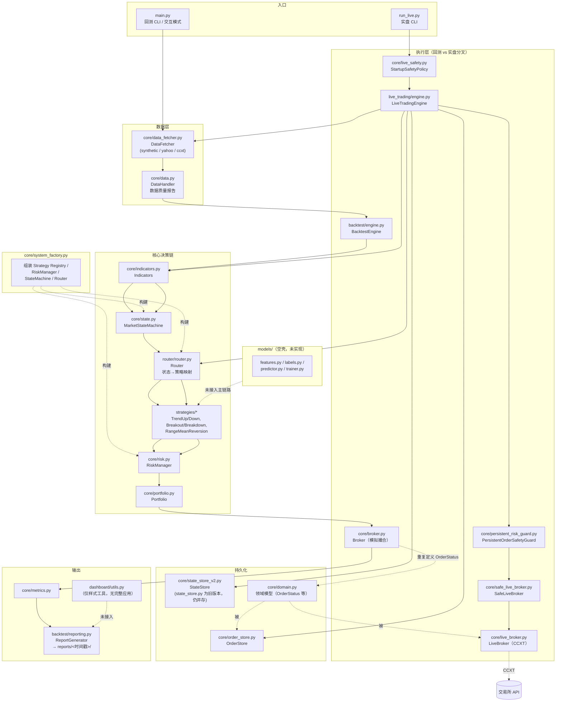

# QauntTradingV1 项目架构与问题分析（2026-08-03）

## 一、项目定位

一个以「市场状态识别 → 策略路由」为核心的单体 Python 量化交易框架，回测与实盘（CCXT）共享策略、路由、风控逻辑，分别落地到不同的 Broker 实现。

## 二、架构图

## 三、当前问题（按优先级）

### P0：真实资金上线阻断项

1. **实盘容错闭环不完整。** 实盘错误处理以捕获异常继续轮询为主，缺统一的重试/指数退避、限流、熔断、告警和人工恢复状态机；网络抖动或交易所异常响应可能造成本地持仓与交易所实际持仓分叉。
2. **对账闭环未成型。** 已有 `OrderStore`，但「提交前持久化 → 交易所确认 → 重启恢复 → 周期性对账」尚未形成完整链路。
3. **状态持久化方案偏轻。** `live_status.json` 只适合做监控快照而非权威账本；`state_store_v2.py` 用 SQLite 单机存储，缺备份、迁移、锁竞争与损坏恢复方案。

（此前一版分析中「CLI 传递 API Key/Secret」的问题已修复：`run_live.py` 现在强制从环境变量读取凭证，缺失时直接报错退出，不再接受命令行参数传入密钥。）

### P1：架构一致性与正确性风险

1. **领域模型重复。** `core/broker.py` 和 `core/domain.py` 各自定义 `OrderStatus`（前者继承 `Enum`，后者继承 `str, Enum`），存在类型与状态迁移语义漂移风险。
2. **状态存储重复。** `core/state_store.py` 与 `core/state_store_v2.py` 同名同责并存，实盘引擎直接依赖 v2，缺少清晰的迁移边界或唯一公共接口，旧文件容易被误用。
3. **回测/实盘执行语义未强约束一致。** 二者共享策略与 Router，但 `Broker`（模拟撮合）与 `LiveBroker`（CCXT）没有显式的执行端口协议（Protocol/ABC），容易出现「回测可运行、实盘语义不一致」的情况。
4. **研究脚本游离于生产引擎之外。** `research/`、`archive/` 下的回测逻辑与 `backtest/engine.py` 不共用，研究结论可能与生产系统的费用、时间线和成交语义不一致。
5. **配置双来源。** `config/config.py` 内置默认费率与 `config/params.yaml` 并存，且两者数值不同（如 taker 费率 0.001 vs 0.0005），YAML 缺失或加载失败时结果会静默改变而不报错。

### P2：工程质量与可维护性

1. **ML 子系统仅为空壳。** `models/features.py`、`labels.py`、`predictor.py`、`trainer.py` 均只有 3 行占位代码，但作为正式顶层包存在，容易造成能力被高估。
2. **Dashboard 名不副实。** `dashboard/` 目录下只有 `utils.py`（主题/样式工具，416 行），没有完整的可运行应用入口；README 中的监控能力容易被高估。
3. **入口/遗留代码歧义。** 根目录 `Trading_V1_Model.py`、`verify_*.py` 与 `archive/` 下的旧实现并存，增加入口选择歧义和重复维护成本。
4. **异常处理过宽。** 多处捕获宽泛 `Exception`，`main.py:288` 仍有裸 `except: pass`，会吞掉失败原因、降低可观测性。
5. **文档/命名问题。** 项目目录名为 `QauntTradingV1`（`Quant` 拼写错误），影响可信度；部分文档注释存在编码问题。
6. **仓库卫生。** 当前工作区存在大量生成物（`__pycache__/*.pyc`、`reports/*`、`dummy_output/*`）处于已跟踪且频繁变更状态，`.gitignore` 规则仍需收紧。

### P3：测试与交付

1. **测试环境不确定。** 项目 `.venv` 下测试可通过，但系统默认 Python 因 pandas/numpy/PyYAML 缺失会导致多个测试模块导入失败；缺少统一的环境自检命令或任务入口（如 Makefile/tox）。
2. **测试覆盖类型单一。** 现有 26 个测试文件以 unittest/mock/合成数据为主，缺少可定期运行的交易所 sandbox 端到端测试，以及断网、超时、重复响应、部分成交等故障注入测试。
3. **无 CI 门禁。** 仓库中未发现 `.github/workflows` 或等价 CI 配置，也没有类型检查、lint、安全扫描、覆盖率阈值门禁。
4. **依赖锁定不清晰。** `requirements.txt` 使用严格版本，但 `requirements.lock.txt` 混合直接与传递依赖，缺少哈希或平台说明。

## 四、结论与建议顺序

1. 先补齐实盘对账闭环（提交前持久化 → 交易所确认 → 重启恢复 → 周期性对账）与统一的重试/熔断策略（P0）。
2. 统一领域模型（合并 `OrderStatus` 定义）、废弃 `state_store.py` 旧版本、给 Broker/LiveBroker 定义显式执行端口协议、消除配置双来源（P1）。
3. 清理 ML 空壳包、遗留入口和文档编码问题，收紧 `.gitignore`（P2）。
4. 补齐 CI、依赖锁定、故障注入测试和 sandbox 端到端门禁（P3）。

在以上工作完成前，项目适合用于研究、回测和交易所 sandbox 验证，**不建议**在无人值守场景下使用真实资金运行。
