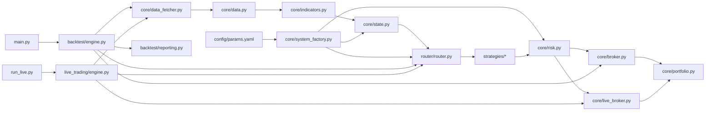
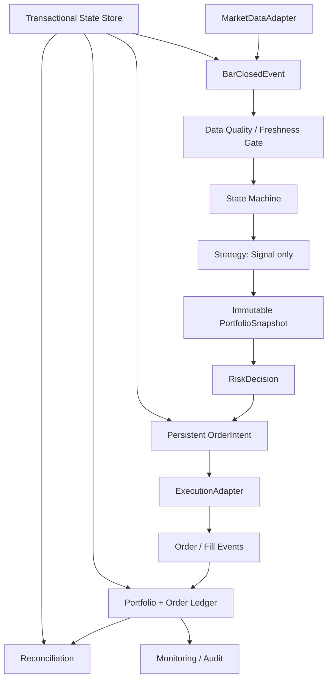

# QuantTradingV1 项目文件与架构分析

> 审计日期：2026-08-01  
> 项目根目录：`D:\QauntTradingV1`  
> 文档性质：当前实现的静态架构分析，不代表生产就绪认证  
> 测试基线：仓库 `.venv` 下运行 41 项测试，40 项通过，1 项失败

## 1. 执行摘要

QuantTradingV1 是一个以 Python 和 pandas 为核心的量化交易研究项目。项目已经形成数据获取、数据质量检查、指标计算、市场状态识别、策略路由、风险审批、回测撮合、绩效报告、CCXT 实盘适配和简单状态导出的基本链路。

当前架构处于“研究原型向可恢复交易系统过渡”的阶段。回测主链路相对完整，实盘主链路仍缺少生产交易系统必须具备的状态与事实闭环。特别是已收盘 K 线过滤、bar 幂等、订单状态机、client order id、unknown order 对账、完整组合估值、持久化熔断和同步失败后的 fail-closed 尚未接入。

因此，当前系统适合：

- 策略研究和指标实验；
- synthetic 或历史数据回测；
- 交易规则和报告原型验证；
- sandbox/testnet 集成开发。

当前系统不适合：

- 无人值守真实资金交易；
- 多交易所统一执行；
- 需要崩溃恢复和订单对账的生产环境；
- 对成交现实性要求严格的大资金容量评估。

## 2. 项目总体结构

```text
QauntTradingV1/
├── main.py                    # 回测/研究主入口
├── run_live.py                # CCXT 实盘轮询入口
├── core/                      # 共享领域逻辑与基础设施
├── strategies/                # 策略实现
├── router/                    # 市场状态到策略的路由
├── backtest/                  # 历史回测和报告
├── live_trading/              # 实盘轮询编排
├── config/                    # YAML 配置加载
├── tests/                     # unittest 回归测试
├── analysis/                  # 参数搜索与绩效绘图
├── research/                  # 独立研究实验
├── dashboard/                 # 展示层辅助代码
├── models/                    # 机器学习占位模块
├── reports/                   # 回测及实盘运行生成物
├── dummy_output/              # 示例输出
├── archive/                   # 历史实现
└── docs/                      # 设计、部署、基线和路线图
```

## 3. 当前逻辑架构



架构风格是模块化单体。回测与实盘共享策略、状态机、路由、风险和 Portfolio，但各自拥有不同的引擎与 Broker。共享工厂 `core/system_factory.py` 用于减少两条链路的配置偏差。

## 4. 主要运行入口

### 4.1 `main.py`：回测与报告入口

主要职责：

- 解析回测输入和运行参数；
- 从 CCXT、Yahoo 或 synthetic 数据源获取数据；
- 调用 `DataHandler` 做质量检查；
- 创建并运行 `BacktestEngine`；
- 调用 `ReportGenerator` 输出报告；
- 保存数据质量报告和路由日志。

它是当前研究与回测的权威入口，但承担了较多编排、异常处理和输出目录管理职责。长期应把命令行解析、数据准备、回测用例定义和报告写入拆开。

### 4.2 `run_live.py`：实盘入口

主要职责：

- 解析交易所、市场类型、交易标的和轮询间隔；
- 构造 `Portfolio`、`RiskManager`、`LiveBroker` 和策略注册表；
- 初始化并运行 `LiveTradingEngine`。

主要风险：

- 未传 `--sandbox` 即进入真实交易所模式；
- API key 可通过命令行传递，可能出现在 shell 历史或进程列表；
- 没有二次 live 确认开关；
- 没有启动前 markets、权限、时间、余额、持仓、未结订单和状态库检查；
- 没有对账完成门槛。

### 4.3 旧入口和验证脚本

`Trading_V1_Model.py`、`verify_range.py`、`verify_router.py` 和 `verify_trend_strategies.py` 属于早期入口或人工验证脚本。它们不在当前共享工厂主链路中，应标记为 legacy/diagnostic，避免被误认为生产入口。

## 5. `core/` 文件分析

### 5.1 `core/data_fetcher.py`

职责：

- 从 Yahoo Finance 获取历史数据；
- 通过 CCXT 获取 OHLCV；
- 支持代理环境；
- 在交易所受限时尝试其他交易所或 Yahoo fallback；
- 生成 synthetic 市场场景；
- 标准化 OHLCV 列名和索引。

优点：数据源抽象集中，测试覆盖了代理和交易所 fallback。

问题：

- fallback 后的数据来源语义可能变化，但下游缺少统一 provenance；
- 没有统一输出数据新鲜度、交易所时间和最后收盘状态；
- 现货与衍生品专属字段没有领域模型；
- 异常处理多以日志和空 DataFrame 表达，调用者难以区分“没有数据”和“获取失败”。

### 5.2 `core/data.py`

`DataHandler` 提供 schema 校验、CSV 加载、OHLCV 重采样、缺口/重复/异常值分析和质量报告生成。

当前它偏向离线数据质量工具。实盘需要进一步提供不可交易标记、数据延迟阈值、连续缺失窗口和 fail-closed 决策结果。

### 5.3 `core/indicators.py`

集中实现 SMA、EMA、ATR、ADX、布林带和批量指标计算。它是市场状态和策略的共同依赖。

主要注意点：

- 指标函数应保持纯函数性质；
- 所有滚动指标必须验证 warmup 和 NaN 边界；
- 通道类指标必须在策略层使用前一根已知值，防止当前 bar 信息泄漏。

### 5.4 `core/state.py`

定义 `MarketState` 和 `MarketStateMachine`，负责将指标转化为趋势上涨、趋势下跌、震荡或高波动状态，并应用稳定性过滤，还提供高低时间周期状态对齐。

该模块是策略路由的关键上游。状态判定与策略表现高度耦合，配置变动需要固定数据回归测试保护。

### 5.5 `core/system_factory.py`

集中创建：

- 策略注册表；
- `RiskManager`；
- `MarketStateMachine`；
- `Router`；
- 不同市场类型是否允许做空的判断。

这是当前减少回测/实盘配置分叉的重要模块。建议继续让所有默认组件只通过工厂构造，并为最终配置生成 hash。

### 5.6 `core/portfolio.py`

保存 cash 和 `symbol -> {qty, avg_price}` 持仓，支持更新持仓、权益、总价值和总暴露计算。

主要限制：

- 数据模型不足以表达冻结资金、保证金、未实现盈亏、实现盈亏和多账户；
- 缺少价格时间戳与 stale 状态；
- 找不到最新价格时可能回退到平均成本，这对实时风险估值不安全；
- 未完成订单的潜在暴露没有纳入组合快照。

### 5.7 `core/risk.py`

实现按止损距离或固定资金比例定仓，以及流动性、杠杆、集中度和日内回撤检查。

主要限制：

- `check_entry_risk` 没有 side/intent 语义，难以准确区分增加风险和降低风险；
- 卖出或平仓也可能被按新增暴露估算；
- 价格缺失时仍可能使用平均成本估值；
- 熔断状态只存在内存中；
- 实盘引擎没有真正调用日内熔断检查；
- 缺少撤单、平仓、halt 等分级动作。

### 5.8 `core/broker.py`

这是回测 Broker，包含：

- `OrderType`、`OrderStatus` 和 `Order`；
- pending/active order 管理；
- market、limit、stop 撮合；
- 手续费、滑点和可选冲击成本；
- Portfolio 更新和 trade audit 字段；
- 按 symbol 撤销遗留订单。

它已经具备 Next-Bar Execution 的基本框架，但仍是 bar 级理想化撮合。缺少基于容量的部分成交、remaining qty、TIF、订单过期以及多订单共享 bar volume。

### 5.9 `core/live_broker.py`

这是 CCXT 实盘适配器，负责：

- 创建交易所连接和 sandbox 模式；
- 同步现货余额；
- 尝试同步衍生品持仓；
- 将 buy/sell/short/cover 映射到 CCXT；
- 调用 `create_order()`；
- 将成功返回追加到内存 trades。

这是当前风险最高的模块：

- 没有确定性 client order id；
- 没有订单状态机和部分成交恢复；
- 超时后不查询交易所订单；
- `sync()` 失败只写日志，不返回结构化健康状态；
- 合约平仓没有 `reduceOnly`；
- 没有 precision、min amount、min cost 和最大可平量检查；
- 把接口返回过早地近似成交易事实。

### 5.10 `core/timeframes.py`

未跟踪的 P0 原型。负责解析固定分钟/小时/日/周 timeframe、统一 UTC 和过滤已收盘 bar。

方向正确，但当前没有接入 `LiveTradingEngine`，也没有验收测试。日历月、交易所特殊 K 线和非固定周期尚未覆盖。

### 5.11 `core/state_store.py`

未跟踪的 SQLite P0 原型。提供通用 key/value 状态和 `processed_bars` 唯一键。

它可以作为 bar 水位线与熔断状态的第一阶段事实存储，但目前没有接入引擎。后续应明确事务边界：订单意图持久化与 bar 水位推进不能形成不可恢复的中间状态。

### 5.12 `core/order_store.py`

未跟踪的 SQLite P0 原型。按 client order id 保存交易所订单 ID、symbol、side、请求数量、成交数量、状态、payload 和更新时间。

当前不足：

- 状态是自由字符串，没有合法迁移约束；
- `update()` 是读取后更新，缺少 compare-and-set/version；
- 没有 fill 表、order event 表和 reconciliation 状态；
- 没有与 `LiveBroker` 连接。

### 5.13 `core/logger.py` 与 `core/metrics.py`

`logger.py` 统一日志初始化。`metrics.py` 目前主要是扩展点，实际绩效指标集中在 `backtest/reporting.py`。指标职责应逐步收敛，避免同一公式存在多个实现。

## 6. `strategies/` 文件分析

### 6.1 `strategies/base.py`

定义策略抽象接口：上下文、入场判断、退出判断和 `on_bar()` 编排。策略通过 Broker 与 RiskManager 间接执行订单。

当前策略接口同时承担信号生成和执行编排，导致策略直接感知 Portfolio、Broker 和风险对象。目标架构应让策略只返回 `Signal`，由共享 pipeline 生成 `OrderIntent`。

### 6.2 `strategies/trend_following.py`

包含 `TrendUpStrategy` 和 `TrendDownStrategy`，使用均线和 ATR 等指标进行趋势方向交易。

### 6.3 `strategies/trend_breakout.py`

包含向上和向下 Donchian 突破策略，使用前期通道避免直接引用当前 bar 通道，并维护部分策略健康/交易结果状态。

### 6.4 `strategies/mean_reversion.py`

`RangeStrategy` 面向震荡状态，使用布林带、ATR 等条件进行均值回归交易。该策略重写了较多 `on_bar()` 编排逻辑，说明基类和执行 pipeline 尚未完全统一。

## 7. `router/` 分析

`router/router.py` 根据 `MarketState` 选择策略，维护每个 symbol 的上一个状态/策略，处理策略切换时的遗留订单、平仓和 cooldown，并输出路由日志。

它是状态识别和策略执行之间的编排层。主要架构风险是切换动作直接产生 Broker 副作用；如果实盘执行失败或进程崩溃，路由状态和交易所事实可能分叉。切换应生成可持久化的 intent/event，而不是只在内存中完成。

## 8. `backtest/` 分析

### 8.1 `backtest/engine.py`

主要流程：

```text
规范化各标的 DataFrame
  -> 建立统一时间轴
  -> 预计算指标和市场状态
  -> 每个事件点先撮合上个 bar 的订单
  -> 更新权益和日内风险
  -> 状态识别与策略路由
  -> 保存权益曲线、交易和基准
```

优点：回测使用共享工厂和共享策略对象，已显式表达 Next-Bar Execution。

主要问题：

- 防前视测试当前没有产生交易，关键时序保护失效；
- 多标的缺 bar 语义需要事件并集测试；
- 估值可以使用旧价格，但必须显式记录 stale；
- bar 级撮合尚未模拟完整订单生命周期；
- 回测和实盘仍是两套编排代码。

### 8.2 `backtest/reporting.py`

负责权益指标、交易分析、文本报告、CSV 和图表输出。它包含大量计算与展示职责，是当前较大的聚合模块。

建议拆分为：

- 统一指标公式模块；
- trade attribution；
- report schema；
- 文本/CSV/图表 renderer。

## 9. `live_trading/` 分析

`live_trading/engine.py` 是轮询式实盘编排器：更新行情、同步账户、逐标的识别状态、路由策略、下单并导出 JSON 状态。

当前实现存在四个结构性问题：

1. 直接使用 DataFrame 最后一行，可能读取未收盘 bar；
2. 没有 bar key 和持久化水位线，同一 bar 可重复处理；
3. 每次只向风险模块传当前 symbol 的价格，不是完整组合快照；
4. `sync()`、路由、下单和状态导出之间没有可恢复事务或事件日志。

此外，`live_status.json` 直接覆盖写入，不是原子快照。写入中断可能让 dashboard 读到损坏 JSON。

## 10. 配置、分析、研究、模型与展示

### 10.1 `config/`

`params.yaml` 是策略、执行、风险和状态机参数源；`config.py` 通过单例加载配置。需要补充 schema 校验、默认值版本和 config hash，防止运行时静默接受拼写错误或缺失字段。

### 10.2 `analysis/`

`optimize.py` 负责网格搜索，`plot_performance.py` 读取报告并绘制绩效。优化工具应强制时间序列切分和样本外评估，避免根据同一历史区间反复选择参数。

### 10.3 `research/`

包含独立 Donchian alpha 和现实性检查脚本以及结果图片。这些文件适合快速实验，但与主回测引擎存在重复实现，研究结论进入主策略前必须迁移到共享 engine 并重跑回归。

### 10.4 `models/`

`features.py`、`labels.py`、`trainer.py` 和 `predictor.py` 当前只有占位类，尚未形成可用 ML pipeline。它们不应接入交易主链路，也不应在文档中声明为现有能力。

### 10.5 `dashboard/`

`dashboard/utils.py` 主要提供主题和 Plotly layout。当前展示层依赖 `reports/live_status.json` 等文件，没有版本化状态 schema 和一致性保证。

## 11. 测试架构与现状

测试采用标准库 `unittest`，覆盖：

| 文件 | 主要覆盖范围 |
| --- | --- |
| `test_indicators.py` | SMA、ATR、ADX、布林带 |
| `test_state.py` | 市场状态和稳定性过滤 |
| `test_router.py` | 策略切换、撤单和平仓 |
| `test_system_factory.py` | 配置工厂和做空映射 |
| `test_p2_orders_pnl.py` | limit/stop 撮合和 PnL 分解 |
| `test_p5_risk.py` | 定仓、杠杆、集中度、熔断重置 |
| `test_p6_live.py` | Broker 同步、简单下单和市场类型 |
| `test_p7_dashboard_integration.py` | 实盘状态 JSON 导出 |
| `test_backtest_engine.py` | 默认组件、风险输入和日切换 |
| `test_no_lookahead.py` | 预期验证 signal bar 与 fill bar |
| `test_data_fetcher.py` | proxy 和数据源 fallback |

2026-08-01 的实际结果是 40/41，通过仓库 `.venv` 才能完整导入。失败项为 `test_no_lookahead.py::test_execution_timing`，原因是没有生成预期交易。系统默认 Python 缺少 pandas、numpy 和 PyYAML，说明环境入口也尚未固化。

关键测试缺口：

- 未收盘 bar 不发布；
- 同一 bar 连续 tick 只处理一次；
- 重启后不重复下单；
- create_order 超时但交易所已创建订单；
- partial fill 和 unknown order 对账；
- reduce-only 本地校验；
- sync 失败后禁止新增风险；
- 多标的完整估值和 stale price；
- 熔断重启恢复和幂等平仓；
- 多资产非对齐时间轴。

## 12. 生成物、依赖与仓库卫生

`reports/` 和 `dummy_output/` 中包含回测 CSV、图片、文本报告、路由日志和 live status。这些属于运行生成物，不应与源码职责混合。

当前 `.gitignore` 没有覆盖 reports、SQLite 状态文件、临时日志和 dashboard 缓存。历史报告若需要保留，应明确放入版本化 fixtures 或 artifacts，而不是默认全部跟踪。

仓库同时存在 `.venv/` 和 `venv/`，虽然二者都被忽略，但会增加解释器选择歧义。`requirements.txt` 是直接依赖，`requirements.lock.txt` 是完整冻结依赖；测试工具和运行依赖尚未明确分层。

多个源码和文档文件存在中文乱码，表明历史文件编码不统一。建议新增文件统一 UTF-8/LF，旧文件按模块逐批修复并检查 diff。

## 13. 当前架构的核心耦合

| 耦合点 | 当前表现 | 影响 |
| --- | --- | --- |
| 策略与执行 | 策略 `on_bar()` 直接持有 Broker/RiskManager | 信号研究难以与执行规则独立验证 |
| Router 与交易副作用 | 状态切换可直接撤单和平仓 | 崩溃后无法仅靠路由状态恢复 |
| Portfolio 与价格 | 方法直接接收普通价格字典 | 缺少时间、新鲜度和来源语义 |
| LiveBroker 与订单事实 | 接口返回直接写入内存 trades | 部分成交和 unknown 状态不可恢复 |
| 引擎与状态 | 关键进度大多在内存 | 重启可能重复处理或丢失事实 |
| 报告与公式 | 计算和渲染集中在大模块 | 公式复用、监控一致性和测试困难 |
| 回测与实盘 | 共享组件但不共享完整 pipeline | 行为可能随两套编排逐渐分叉 |

## 14. 建议的目标架构



建议新增或稳定以下领域对象：

- `BarKey`：exchange、market type、symbol、timeframe、close time UTC；
- `Signal`：策略输出，不包含交易所细节；
- `PortfolioSnapshot`：cash、equity、gross/net exposure、价格时间和订单风险占用；
- `RiskDecision`：allow/reject、原因、风险动作；
- `OrderIntent`：确定性 id、目标 side/qty、reduce-only、来源 signal；
- `OrderRecord`：本地和交易所 ID、状态、请求量、成交量；
- `Fill`：实际成交事实和费用；
- `SyncHealth`：账户同步是否成功、新鲜度和失败原因；
- `CircuitBreakerState`：交易日、基准权益、触发时间和动作状态。

目标是让回测、历史 replay 和实盘共享：

```text
BarClosedEvent -> State -> Signal -> Snapshot -> RiskDecision -> OrderIntent
```

三者只替换市场数据适配器和执行适配器。

## 15. 建议的目录演进

```text
core/
├── domain.py              # Signal、OrderIntent、Fill 等不可变领域对象
├── events.py              # BarClosed、OrderUpdated、FillReceived
├── pipeline.py            # 共享 signal -> risk -> intent 流程
├── valuation.py           # 组合快照与 stale price 规则
├── orders.py              # 订单状态机
├── exchange_rules.py      # precision/min cost/reduce-only
├── state_store.py         # 水位线、熔断和运行状态
└── order_store.py         # 订单、fill 和事件事实

backtest/
├── engine.py
├── execution_adapter.py
└── reporting/

live_trading/
├── engine.py
├── execution_adapter.py
├── reconcile.py
└── health.py
```

现有文件无需一次性重写。应先把领域对象和存储接入当前实现，再逐步提取共享 pipeline。

## 16. 推荐实施顺序

### P0：实盘安全闭环

1. 修复测试基线和防前视测试；
2. 接入已收盘 bar 过滤；
3. 接入持久化 bar 幂等与重启测试；
4. 定义订单状态机和确定性 client order id；
5. create_order 超时后先查询再重试；
6. 合约平仓强制 reduce-only 和最大可平量；
7. sync 返回 `SyncHealth`，失败时 fail-closed；
8. 建立完整组合快照；
9. 接入持久化日内熔断、撤单和幂等平仓。

### P1：回测可信度

1. 多资产事件并集时间轴；
2. stale price 显式标记；
3. 部分成交、TIF、订单过期和容量约束；
4. spread、impact、funding 和 borrow cost；
5. 回测与 replay 的信号和 intent 序列一致性。

### P2：可观测性和工程化

1. 原子状态快照和 schema version；
2. 对账、告警和启动前检查；
3. 统一环境入口和 CI；
4. 生成物管理和编码修复；
5. 指标公式单一来源。

## 17. 完成定义

项目达到“可长期 sandbox 运行”至少应满足：

- 所有自动化测试通过；
- 未收盘 bar 永不进入策略；
- 同一 bar 在轮询和重启场景下只生成一次持久化 intent；
- unknown order 最终都能对账；
- 账户或价格数据陈旧时禁止增加风险；
- 所有风险决策使用完整组合快照；
- 熔断状态重启后仍有效；
- 任意成交可追踪到 signal、risk decision、order intent、order 和 fill；
- sandbox 故障注入覆盖超时、断网、限流、部分成交和进程终止；
- 连续运行至少 14 天，无重复订单和无法解释的仓位差异。

达到以上条件仍不等于可以直接使用大额真实资金；进入小额实盘前还需要样本外策略验证、权限最小化、人工急停和分阶段放行。
