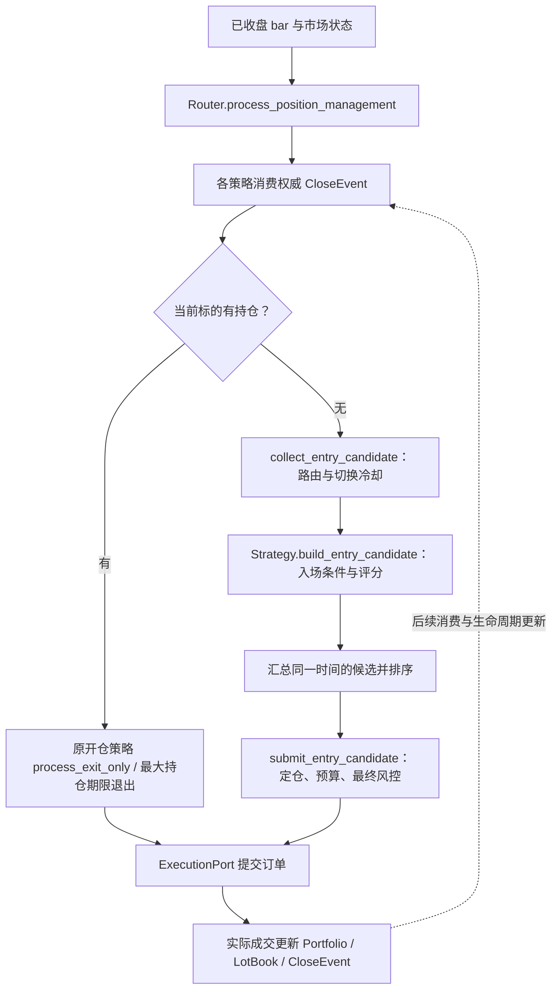

# strategies/ 策略模块说明

本文按 **2026-10-01 当前工作区代码及 `config/params.yaml`** 整理，说明策略接口、实际交易规则、运行接线和扩展方法。工作区中尚未提交的 V2/V3 实现也包含在内；项目阶段、研究结论和准入证据仍以[统一 Roadmap](../unified_roadmap.md)及对应契约为准。

策略模块提供可插拔的信号生成器，以及共用的退出、定仓和成交回调流程。回测与实盘复用这些策略类，调度、撮合、账户核算和恢复分别由外围模块负责。策略注册和政策注入集中在[组合工厂](../../composition/factory.py)，真实资金准入由[策略治理模块](../../core/strategy_governance.py)另行检查。

## 1. 文件与策略清单

| 文件 | 主要对象 | 职责 |
| --- | --- | --- |
| [`base.py`](../../strategies/base.py) | `Strategy` | 统一接口、上下文、入场候选、订单提交、硬止损及平仓事件消费 |
| [`trend_breakout.py`](../../strategies/trend_breakout.py) | `TrendBreakoutStrategy`、`TrendBreakdownStrategy` | Donchian 多头突破与空头破位；复用健康、保护止损和候选评分 mixin |
| [`mean_reversion.py`](../../strategies/mean_reversion.py) | `RangeStrategy` | 布林带、RSI、ATR 过滤及逐标的连亏冷却 |
| [`volatility.py`](../../strategies/volatility.py) | `VolatilityReversionStrategy` | 价格扩张后的均值回归与随机指标确认 |
| [`trend_portfolio_v2.py`](../../strategies/trend_portfolio_v2.py) | `TrendPortfolioV2Strategy` | 多周期趋势符号分数、状态风险倍率、波动率定仓及 ATR 退出 |
| [`trend_portfolio_v3.py`](../../strategies/trend_portfolio_v3.py) | `TrendPortfolioV3Strategy` | 日线连续动量、两种入场版本与组合目标接口 |
| [`statistical_arbitrage.py`](../../strategies/statistical_arbitrage.py) | `PairSignal`、`PairsTradingModel` | 双序列价差研究模型；尚未包装为 `Strategy` |
| [`__init__.py`](../../strategies/__init__.py) | 无公共导出 | 当前为空；通过具体模块导入策略类 |

`Cash` 是路由映射中的空仓选择，没有对应的策略类。当前目录没有 `trend_following.py`，默认注册表也没有旧名称 `TrendUp`、`TrendDown`。

### 1.1 默认注册、路由与治理

| 策略名称 `name` | 类 | `allowed_states` | 默认路由情况 | 当前治理状态 |
| --- | --- | --- | --- | --- |
| `TrendBreakout` | `TrendBreakoutStrategy` | `TREND_UP` | `TREND_UP → TrendBreakout` | `paused_revalidation` |
| `TrendBreakdown` | `TrendBreakdownStrategy` | `TREND_DOWN` | `TREND_DOWN → Cash` | `paused_redesign` |
| `RangeMeanReversion` | `RangeStrategy` | `SIDEWAYS` | `SIDEWAYS → Cash` | `paused_redesign` |
| `VolatilityReversion` | `VolatilityReversionStrategy` | `VOLATILE` | `VOLATILE → Cash` | `isolated_research` |
| `TrendPortfolioV2` | `TrendPortfolioV2Strategy` | 四种正常状态，不含 `NO_TRADE` | 仅当有效路由引用该名称时注册 | 默认配置无条目；专用研究脚本设为 `isolated_research` |
| `TrendPortfolioV3` | `TrendPortfolioV3Strategy` | 四种正常状态，不含 `NO_TRADE` | 仅当有效路由引用该名称时注册 | 默认配置无条目；专用研究脚本设为 `isolated_research` |

这里的四种正常状态指 `TREND_UP`、`TREND_DOWN`、`SIDEWAYS`、`VOLATILE`。默认 YAML 未配置 `NO_TRADE` 路由，因此该状态不产生新入场候选。

`build_strategy_registry()` 在没有研究路由时构建前四个策略。**被注册、允许某种状态、被当前路由选中、被允许使用真实资金，是四个独立条件。** 当前默认配置没有 `admitted` 策略；`assert_live_admission(...)` 只接受该治理状态，缺失条目按未准入处理。研究身份和参数覆盖也会受到真实资金入口检查。

## 2. 运行流程与模块边界

普通策略通过[共享运行内核](../../core/runtime.py)和[Router](../../router/router.py)进入下列流程：



1. **持仓管理优先。** Router 从 `Portfolio.lot_books` 查找原开仓策略，由它继续管理退出；不会因当前映射变成 `Cash` 就隐式执行 `StateSwitch` 平仓。最大持仓期限是独立退出控制，当前配置为 365 天。
2. **空仓才收集候选。** 路由策略名称发生变化时，撤销旧入场意图并设置冷却。当前 `cooldown_bars=2`，条件是 `i <= cooldown_until`；仅状态变化但仍映射到同一个策略名称时，不触发这种切换冷却。
3. **候选先汇总，再分配。** [PortfolioSignalAllocator](../../core/allocation.py) 按 `(-score, strategy_name, symbol)` 排序后逐项提交。完全同分批次记录 `tie_break_alphabetical`，不能把确定性的名称排序解读为策略优势。
4. **接受订单后等待实际成交。** 策略不直接修改组合数量、现金或已实现盈亏；这些事实由执行层写入。

`Strategy.on_bar(...)` 保留单标的“先退出、再入场”的兼容流程。当前 Router 主路径使用拆开的持仓管理与候选方法，没有 `Router.route()` 接口。组合级排序和相关风险批次预算应通过主路径完成。

**V3 有独立接线：** 注入 `PortfolioTargetController` 后，共享内核继续管理原策略的退出，但不再走普通入场候选分配，而由控制器推进组合目标。完整接线见第 9 节。

### 2.1 数据与时间约定

| 输入 | 约定 |
| --- | --- |
| `symbol` | 标的名称；进入策略前的规范化、成员过滤由数据和 universe 模块负责 |
| `i` | 当前标的 DataFrame 的位置索引，以 `.iat[i]` / `.iloc[...]` 读取；不是所有标的通用的历史长度 |
| `df` | 至少满足对应策略所需的 `high`、`low`、`close`；通常还含 `open`、`volume`，索引为时间戳 |
| `state` | `MarketState` 枚举；默认状态机参数为 MA20/60、ADX14 阈值 25、ATR14/价格阈值 0.025、稳定确认 5 bar |
| `portfolio` | 真实组合事实，含带符号的持仓数量及批次账本；策略只据此判断和提议操作 |

普通历史回测在 bar `i` 收盘产生信号，市价订单在下一根可执行 bar 撮合。信号中的 `price` 是参考价，不保证等于实际成交价。盘中常驻保护单及回测结束处理有各自的执行规则，见[回测行为说明](../backtest_assumptions.md)。

策略可能在共享 `df` 上补充指标列；只读取截至 `i` 已知的值。正确的包含当前 bar 的历史切片是 `df.iloc[:i + 1]`；`df.iloc[:i]` 不包含位置 `i`。Donchian 的历史通道再额外使用 `shift(1)`，排除本根 bar 的高低点。

V3 要求 UTC 日线开盘时间索引，并按 `close_time` 和 `available_at` 过滤信息可得时间；没有 `close_time` 时，默认该日线在索引时间加一天后收盘。它不是可直接套用到任意周期的通用策略。

## 3. Strategy 基类接口

### 3.1 必须实现与可扩展的方法

```python
def should_enter(self, symbol, i, df, state, portfolio):
    # 返回 None，或 action 为 buy / short 的信号字典。
    ...

def should_exit(self, symbol, i, df, state, portfolio):
    # 返回 None，或 action 为 sell / cover 的信号字典。
    ...
```

| 方法 | 用途与返回约定 |
| --- | --- |
| `should_enter(...)` | 抽象方法；决定入场条件，不自行提交订单 |
| `should_exit(...)` | 抽象方法；决定普通退出条件，不自行核算盈亏 |
| `raw_entry_signal(symbol, i, df)` | 可选被动观察接口；返回内生条件产生的原始候选；默认抛 `NotImplementedError` |
| `process_exit_only(..., broker)` | 消费成交事实、硬止损检查、普通退出及退出单提交 |
| `build_entry_candidate(...)` | 在空仓、无 `entry_pending` 且状态被允许时构建 `EntryCandidate` |
| `initial_entry_quantity(...)` | 可覆盖的初始数量提议；V2 实现波动率定仓 |
| `health_risk_multiplier()` | 策略健康风险倍率；普通基类默认 `1.0` |
| `entry_risk_multiplier(state)` | 策略对当前状态的风险偏好；普通基类默认 `1.0` |
| `submit_entry_candidate(...)` | 统一定仓、约束、信号发布和订单提交 |
| `on_partial_close(...)` | 可选部分平仓回调；不表示完整交易结束 |
| `on_trade_closed(symbol, realized_pnl, trade, bar_index)` | 同一持仓身份平完后回调，用于健康和连亏状态更新 |
| `reset_runtime_state()` / `bind_state_store(...)` | 清理共用运行状态 / 恢复持久化平仓游标；子类额外状态需自行处理 |
| `health_snapshot()` | 报告使用的健康快照；无健康状态机时为 `{}` |

被动观察器为 `raw_entry_signal` 提供私有历史切片。该接口可以在切片上缓存指标，但不能改变策略上下文、健康、计数器、订单或组合事实。当前六个 `Strategy` 实现均有原始候选接口；未知插件不会被观察器通过调用 `should_enter` 来试探。V2/V3 的状态过滤、组合资格或目标分配仍在后续阶段处理。

### 3.2 信号字典

| 字段 | 必需性 / 默认值 | 含义 |
| --- | --- | --- |
| `action` | 必需 | 入场：`buy`、`short`；退出：`sell`、`cover` |
| `stop_loss` | 入场可选，默认 `0.0` | 初始保护价；提供正值时用于按止损风险定仓 |
| `order_type` | 可选，默认 `market` | `market` / `limit` / `stop`，实际能力由执行端口决定 |
| `price` | 可选，默认当前 `close` | 订单参考价，或限价/触发价 |
| `reason` | 退出可选，默认 `signal` | 平仓归因原因 |
| `score` / `priority` | 入场可选，默认 `0.0` | 候选排序读取 `score`，没有该键才回退 `priority` |
| `stop_plan`、`score_components` | 策略附加 | 解释止损来源和评分组成；不是额外订单 |
| `trend_score`、`target_weight` 等 | V2/V3 附加 | 趋势诊断及定仓输入，具体见对应章节 |

例如，一个突破候选可以返回：

```python
{
    "action": "buy",
    "price": 100.0,
    "stop_loss": 95.0,
    "order_type": "market",
    "score": 1.2,
    "score_components": {"breakout_extent": 1.0},
}
```

已有多头只接受 `sell` 退出，已有空头只接受 `cover` 退出。基类策略入场仅作用于空仓，不提供持仓中的加仓机制；V3 的目标增减仓由组合控制器另行执行。

### 3.3 上下文与平仓生命周期

`context` 按 `symbol` 保存跨 bar 状态。入场订单被执行端口接受后，基类初始化：

| 字段 | 提交时的含义 |
| --- | --- |
| `entry_pending=True` | 入场意图已被接受，空仓期间避免重复入场 |
| `entry_price` | 信号 bar 的收盘参考价；实际盈亏读取成交和批次事实 |
| `stop_loss` | 审批时的初始止损价 |
| `trailing_stop` | 多头初始化为 `-inf`，空头为 `inf`，后续按策略更新 |
| `entry_bar` | 入场信号的位置索引，用于普通退出冷却 |

退出单被接受后设 `exit_pending=True`，不立即清空上下文。未成交、部分成交和完整平仓不能用同一状态替代。若入场未形成持仓，且执行端口明确报告没有活跃入场订单，平仓事件消费流程会释放入场上下文。

`_consume_execution_trades(...)` 读取权威 `CloseEvent`，按 `opening_strategy_id` 归属于原开仓策略。它对 `(symbol, position_id)` 累积平仓数量、已实现盈亏、初始风险和事件身份，部分平仓调用 `on_partial_close`，平完后只调用一次 `on_trade_closed`；组合已空仓时才清理相关上下文。因此，Router、账户风险或回测结束触发的平仓仍能更新原策略。

`observed_close_events` 当前统计消费的平仓事件数，可能包含部分平仓或多 lot 片段，不等于完整往返交易次数。平仓流使用增量游标，近期事件/持仓去重集合各保留最多 2,048 项；`strategy_close_cursor:<name>` 检查点保存游标、待消费事件、未完成聚合、上下文及存在的 `trade_state`。事件流被替换或截断时会抛错，而不会默默重计。

## 4. 共用定仓、评分与止损

### 4.1 普通候选的风险定仓顺序

默认基类的初始数量由 [RiskManager](../../core/risk/position_sizing.py) 计算：

```text
有正止损：q0 = equity × risk_per_trade / abs(close - stop_loss)
无正止损：q0 = equity × 0.10 / close
```

风险管理器会先检查账户闸门，并在上述数量中应用账户 `risk_multiplier`。`submit_entry_candidate(...)` 再执行：

1. 应用策略健康倍率和 `entry_risk_multiplier(state)`。
2. 读取挂单预留敞口，经 `clamp_entry_qty` 约束账户杠杆、单标的、相关簇及现金/保证金。
3. 通过 `PortfolioRiskGovernor` 缩减同一批次新增初始风险和相关簇止损风险。
4. 通过回撤预算继续缩减，并检查最低可入场金额。
5. 执行 `check_entry_risk` 最终检查，发布 `Signal` 事实后提交订单；只有接受的订单才初始化上下文和提交相关预算。

初始风险审批额采用 `qty × abs(close - stop_loss)`。当前配置 `entry_risk.enabled=true`、容差 `0.10`、动作为 `resize`，执行层在实际成交后复核跳空造成的超预算风险，并通过 `GapRiskResize` 处理。账户、挂单、回撤和成本的完整口径见[组合风险契约](../portfolio_risk_contract.md)及[已批准入场风险契约](../research/approved_entry_risk_contract_20260912.md)。

### 4.2 Donchian 候选评分

多头突破和空头破位复用[候选评分模块](../../core/candidate_scoring.py)，默认权重为：

| 分项 | 计算依据 | 权重 |
| --- | --- | --- |
| `breakout_extent` | 价格越过入场通道的幅度 / ATR，按多空方向取值 | `1.0` |
| `trend_strength` | `(ADX - 25) / 25` | `0.5` |
| `volume_confirmation` | 同向 OBV 净变化 / 近期 OBV 变化尺度 | `0.3` |
| `liquidity` | `log10(volume × close / 10,000,000) + 1` | `0.2` |

各有效分项裁剪到 `[-5, 5]`，缺失分项不加入总分。ATR 缺失时突破幅度可按价格的 1% 归一化。该处 `volume × close` 是排序特征；V3 的实际报价币成交额资格使用独立的 `quote_volume` 字段。

V2 用趋势符号分数替代这组评分，V3 用连续动量替代。配置 `candidate_scoring.enabled=false` 不能据此推断 V2/V3 的趋势排序被关闭。

### 4.3 初始止损、硬止损与移动止损

[保护止损函数](../../core/protective_stops.py)支持三种初始模式：

| 模式 | 多头 | 空头 |
| --- | --- | --- |
| `structural_donchian` | 出场窗口的历史最低价 | 出场窗口的历史最高价 |
| `atr` | `close - k × ATR` | `close + k × ATR` |
| `hybrid` | 结构止损与 ATR 止损中有效的较高价 | 两者中有效的较低价 |

没有有效保护价或止损距离小于价格的 0.5% 时拒绝信号；距离超过价格的 35% 时裁剪至最大允许距离。当前默认 Donchian 策略关闭 ATR 初始腿和追踪腿，不会将异常结构止损隐式替换为 5% 止损。`use_atr_initial_stop=true` 的兼容解析是 `hybrid`；选择纯 ATR 需要显式模式，V2/V3 会按研究退出参数注入。

**普通退出冷却不阻止硬止损。** `process_exit_only` 先检测已生效的 `stop_loss`：多头 `low <= stop_loss`、空头 `high >= stop_loss` 时提议市价退出；没有 high/low 列时回退当前 close。仅在未触发硬止损且 `i > entry_bar + 1` 时调用 `should_exit`。

移动止损在本根硬止损检查后更新，只约束后续 bar。Chandelier 多头采用 `max(旧止损, 初始止损, 持仓最高价 - k × ATR)`，空头取镜像的 `min`，不会放松保护。保本腿默认关闭。

基类硬止损是收盘决策流程中的检测与订单提交；[常驻保护单](../../core/protective_orders.py)及[回测盘中保护模拟](../../backtest/protective_stops.py)另有成交路径。当前 `protective_orders.enabled=true`、`backtest_resident=true`；盘中回测使用登记的保守路径，不将所有止损视为下一开盘成交。完整行为见[保护止损契约](../protective_stop_contract.md)。

## 5. TrendBreakout / TrendBreakdown

源码：[trend_breakout.py](../../strategies/trend_breakout.py)。两类均默认 `entry_window=20`、`exit_window=10`、`use_obv=true`。

| 条件 | `TrendBreakout` 多头 | `TrendBreakdown` 空头 |
| --- | --- | --- |
| 入场状态 | `TREND_UP` | `TREND_DOWN` |
| 入场通道 | `high.rolling(20).max().shift(1)` | `low.rolling(20).min().shift(1)` |
| 入场比较 | `close > 历史最高价` | `close < 历史最低价` |
| OBV 确认 | `OBV[i] > OBV[i - 20]` | `OBV[i] < OBV[i - 20]` |
| 默认初始止损 | `low.rolling(10).min().shift(1)` | `high.rolling(10).max().shift(1)` |
| 普通通道退出 | `close < 出场通道`，`sell` | `close > 出场通道`，`cover` |
| 状态退出 | 状态不在 `allowed_states`，`sell` | 状态不在 `allowed_states`，`cover` |

OBV 确认仅在存在 OBV 数据时生效：策略可从 `volume` 自动计算 OBV；数据源没有成交量且没有 OBV 列时跳过确认。通道和 OBV 比较均使用严格不等号。原始信号先计算，再由健康闸门决定是否允许新风险；被闸门拦截的有效 setup 仍累计为诊断事实。

### 5.1 健康生命周期

两个 Donchian 策略及继承它们的 V2/V3 共用 `_PersistentHealthMixin` 与[StrategyHealthMachine](../../core/strategy_health.py)，健康状态按策略名称分别管理。

观察单位是退出 **cohort**，由原开仓策略、UTC 平仓日、退出控制方及适用的风险动作身份组合。策略自身保护止损的不同订单 ID 不拆成多个独立健康样本；同一观察组内合并权威净盈亏与初始风险，计算 R。当前计入健康触发的控制方为 `strategy` 和 `router`；账户风险与系统收尾退出仍保留归因报告。

以下为当前 YAML 注入值；直接构造类而不经过配置工厂时，`StrategyHealthPolicy()` 的部分默认值不同。

| 参数 | 当前配置 | 行为 |
| --- | --- | --- |
| `consecutive_negative_cohorts` | `3` | 达到连续负 cohort 阈值进入冷却 |
| `cooldown_days` | `30` | 常规冷却按时间到期，随后进入恢复观察 |
| `unified_recovery` / `recovery_stages` | `true` / `[0.10, 0.25, 0.50, 1.00]` | 从低风险阶段逐级恢复至 ACTIVE |
| `probation_required_cohorts` | `5` | 阶段至少有足够的已关闭 cohort |
| `recovery_stage_min_days` | `30` | 正面证据不能跳过阶段最短观察期 |
| `probation_min_distinct_symbols` | `3` | 恢复证据要求标的分散 |
| `probation_require_positive_without_best` | `true` | 剔除最佳 cohort 后总 R 仍需为正 |
| `max_failed_probation_cycles` / `repeated_failure_action` | `2` / `extended_cooldown` | 反复失败仍可恢复，进入延长冷却 |
| `extended_cooldown_days` | `90` | 延长冷却长度 |

健康只阻止或缩减新入场，已有仓位退出继续执行。显式 `MANUAL_LOCK` 不因时间流逝自动解除，需要带授权信息的恢复。`health_stats` 是兼容视图，健康状态机才是权威；当前不是永久 `is_alive=False` 开关。

健康通过 `strategy_health:<name>` 保存；报告快照还包含 `raw_setup_count`、被抑制 setup 数与时间、状态迁移及恢复阻断原因。相关参数仍为研究候选，详见[健康契约](../strategy_health_contract.md)及[统一规则契约](../roadmap_policy_contract.md)。

## 6. RangeMeanReversion

源码：[mean_reversion.py](../../strategies/mean_reversion.py)。Python 类名为 `RangeStrategy`，策略身份为 `RangeMeanReversion`，只允许 `SIDEWAYS`。

默认指标为 BBANDS(20, 2.0)、ATR14、RSI14，构造参数为 `atr_threshold_pct=0.03`、`rsi_oversold=30`、`rsi_overbought=70`、`use_rsi=true`。

| 操作 | 条件 | 初始止损 / 退出原因 |
| --- | --- | --- |
| 做多 | `low <= BB_LOWER` 且 `RSI < 30` | `close - ATR14` |
| 做空 | `high >= BB_UPPER` 且 `RSI > 70` | `close + ATR14` |
| 平多 | `close >= BB_MIDDLE` | `Target hit (Mid Band)` |
| 平空 | `close <= BB_MIDDLE` | `Target hit (Mid Band)` |

入场还要求 `ATR14 / close <= 0.03`，且不在逐标的冷却期。`use_rsi=false` 时取消 RSI 确认。若同根 bar 同时满足两端入场条件，代码先判断多头分支。

`should_exit` 保留 bar 低/高越过止损的检查，主流程的统一硬止损会更早处理触及止损的情况。该策略的普通退出没有额外的 regime 强平条件；已有仓位仍由原策略管理，另受统一止损和最大持仓期限约束。

每个标的的 `trade_state` 记录 `consecutive_losses` 和 `cooldown_until`。权威完整平仓回调中，连续 3 笔已实现亏损后设 `cooldown_until = bar_index + 24` 并重置连亏计数，`i <= cooldown_until` 不开新仓；非负盈亏重置连亏。

当前类继承基类执行编排，**没有重写 `on_bar`，也不在提交退出时估算盈亏**。文件顶部关于重写 `on_bar` 的旧说明不代表当前实现。默认注册此类，但 SIDEWAYS 实际路由为 Cash，治理状态为 `paused_redesign`。

## 7. VolatilityReversion

源码：[volatility.py](../../strategies/volatility.py)。只允许 `VOLATILE`，默认参数如下：

| 参数 | 默认值 |
| --- | --- |
| `window` | `20` bar |
| `entry_z` | `2.0` |
| `stop_atr` | `1.5` |
| `stoch_oversold` / `stoch_overbought` | `20.0` / `80.0` |
| `use_stochastic` | `true` |

定义 `mean=rolling_mean(close, 20)`、`std=rolling_std(close, 20)`、`z=(close-mean)/std`：

- `z <= -2` 且 `%K < 20` 时做多。
- `z >= 2` 且 `%K > 80` 时做空。
- 多头回到 `close >= mean`、空头回到 `close <= mean` 时退出；状态不被允许时也提议退出。

该文件中用于保护距离的 `risk=rolling_mean(high-low, 20)`，止损为 `close ± 1.5 × risk`。虽然参数名为 `stop_atr`，**这里没有使用包含隔夜跳空的标准 ATR 指标**。`use_stochastic=false` 取消随机指标确认；入场仍要求均值、标准差及风险尺度有效且为正。

此策略共用基类硬止损，没有 Donchian 健康 mixin。默认 VOLATILE 路由为 Cash，治理状态为 `isolated_research`。

## 8. TrendPortfolioV2

源码：[trend_portfolio_v2.py](../../strategies/trend_portfolio_v2.py)，继承 `TrendBreakoutStrategy`。这是显式启用的只做多研究策略。

### 8.1 入场分数与状态倍率

默认周期 `horizons=(20, 60, 120)`，归一化权重 `(0.50, 0.30, 0.20)`。分数使用各周期收益的**符号**：

```text
S = 0.50 × sign(close[i] - close[i-20])
  + 0.30 × sign(close[i] - close[i-60])
  + 0.20 × sign(close[i] - close[i-120])
```

仅 `S > 0.30` 产生多头候选，再通过继承的 Donchian20 突破、OBV 确认和健康闸门。历史长度还要满足入场/退出窗口、ATR 和波动率预热，默认至少有当前点与 120 个先前点。

| 状态 | 默认 `risk_multiplier` 模式 | 额外入场规则 |
| --- | --- | --- |
| `TREND_UP` | `1.00` | 正常趋势入场 |
| `SIDEWAYS` | `0.25` | `S >= 0.60` 且突破幅度至少 `0.50 ATR` |
| `VOLATILE` | `0.50` | 仍须通过趋势、突破和健康条件 |
| `TREND_DOWN` | `0.00` | 不开新多头，继续管理已有仓位 |
| `NO_TRADE` | 不允许 | 不开新仓；普通退出可提议状态退出 |

可登记 `market_state_mode="hard_gate"` 对照，此时只有 TREND_UP 的入场倍率为 1。默认四种正常状态间变化不会仅因状态名称改变就强平已有 V2 多头。

### 8.2 波动率定仓与退出

默认使用最近 20 个完成的对数收益样本标准差，并乘 `sqrt(365)` 年化。波动率有效且大于零后计算：

```text
target_weight = min(0.25, 0.50 × S × 0.10 / annualized_volatility)
risk_weight   = 0.01 × close / (close - stop_loss)
```

初始数量取按 `min(target_weight, 0.25, risk_weight)` 计算的名义仓位与共用止损风险仓位中的较小值，之后继续应用健康、状态和共用风控。`volatility_sizing=false` 可登记为对照，回到基类定仓。周期单位是 bar；非日线须显式调整 `periods_per_year`，不能继续用默认 365。

默认 `exit_mode="atr"`，初始纯 `2.0 ATR` 止损、`2.5 ATR` 追踪，趋势分数变负或 close 跌破此前 60 bar 最低价时退出。`baseline` 恢复父类的短周期通道退出；`hybrid` 使用结构与 ATR 的较紧初始止损。工厂注入的止损距离和保本等其他政策仍保留。

V2 只在新入场时提议波动率目标数量，不定期再平衡持仓，也不保证实际组合年化波动率等于 10%。它有独立健康身份 `TrendPortfolioV2`。完整研究定义、固定对照和产物见[V2 专项文档](../trend_portfolio.md)。

## 9. TrendPortfolioV3

源码：[trend_portfolio_v3.py](../../strategies/trend_portfolio_v3.py)，继承 V2，并通过[selection_v2](../../core/selection_v2.py)和[PortfolioTargetController](../../core/portfolio_target_controller.py)形成全市场周目标研究。

### 9.1 连续动量与两种入场版本

默认分数使用简单收益的幅度，区别于 V2 的符号分数：

```text
S = 0.50 × (close[i] / close[i-60] - 1)
  + 0.50 × (close[i] / close[i-120] - 1)
```

价格和流动性资格要求：`S > 0`、`close > SMA120`、默认至少 121 个连续完整且可得的日线点、最近 20 日实际 `quote_volume` 中位数不少于 5,000,000，以及有效 ATR 保护价。组合选币还检查可核验的加密资产分类、上市至少 180 天、分类与上市信息的可得时间及退市公告。

| `variant` | 新增风险的额外要求 |
| --- | --- |
| `momentum`，默认 | 通过价格、流动性和组合资格后可进入目标 |
| `breakout` | 另需 close 高于此前 20 日 high，及启用 OBV 时的同向净累积 |

选币模式为 `all_qualified`，不截取 TopN；突破是允许新增风险的条件，已有仓位不需要每天重复突破。所有正常状态的策略入场倍率均为 1，不再使用 V2 的 SIDEWAYS 强突破附加闸门；NO_TRADE 仍不可新增风险。

报价币成交额必须来自实际 `quote_volume`，不能以 `close × volume` 填充。日线缺失、陈旧、数据延迟发布和信息尚不可得会影响资格，不通过填充未来数据消除这些条件。

### 9.2 目标与执行接线

`set_portfolio_targets(weights)` 接受组合协调方的非负有限目标权重；普通 V3 信号从中读取 `target_weight`，没有目标时默认为 0。单独更改 routing 只注册策略，**不会自动创建周调仓控制器**，无法得到完整组合执行。

专用 [V3 runner](../../scripts/run_trend_portfolio_v3.py) 使用 `make_controller(...)`，将 `PortfolioTargetController` 注入 `BacktestEngine` 和共享内核：

1. 周一 UTC 使用已完成日线做全横截面选择，冻结本周目标；周日已完成 bar 的信号可在周一执行。
2. 逆 60 日波动率生成相对权重，以最近 60 个日简单收益估计样本协方差，再按 365 日年化并向对角收缩 20%，估算组合风险；约束前目标波动率为 10%。
3. 应用单币 30%、子簇 150%、加密总敞口 200%、总敞口 300%、单币初始风险 1%、父级初始风险 3% 和单日新增风险 2% 等约束；削减后不重新分配剩余预算。
4. 每日根据真实持仓、挂单和成交推进剩余目标。普通相对偏差容忍 10%，普通周换手限制为冻结权益的 50%，强制退出单独处理。
5. 实际下单仍经过账户批准、共用风险管理、预算预留和 Broker；未成交卖出提案不能作为已到账资金。健康及账户倍率按该路径各应用一次，目标提供者保持相应倍率为 1。

止损、账户风险或已知退市退出会取消旧目标的继续买入资格，不能从未到期的本周目标立即补回刚平掉的仓位。融资研究使用明确的 `assumed` 或 `verified_only` 口径，不用目标权重制造负现金。

V3 默认初始 `2 ATR`、追踪 `2.5 ATR`，连续动量转负或跌破此前 60 日低点时退出；退出指标也按完成且可得的历史计算。365 天最大持仓控制仍独立存在。V3 runner 的完整数据契约、融资口径与固定研究比较见[V3 专项文档](../trend_portfolio.md)。当前默认主程序及实盘入口没有自动接入该控制器。

## 10. PairsTradingModel 配对研究

源码：[statistical_arbitrage.py](../../strategies/statistical_arbitrage.py)。它没有继承 `Strategy`，没有组合定仓、订单提交、持仓上下文、健康或自动配对平仓接线，也不在默认注册表中。

`signal(left: pd.Series, right: pd.Series) -> PairSignal` 将序列按索引对齐、删除缺失值，取最近 60 个共同点，默认先要求收益相关系数的绝对值至少为 0.6，然后计算：

```text
hedge_ratio = cov(left, right) / var(right)
spread      = left - hedge_ratio × right
z_score     = (最新 spread - spread 均值) / spread 标准差
```

| 条件 | `PairSignal.action` |
| --- | --- |
| `z >= 2.0` | `short_left_long_right` |
| `z <= -2.0` | `long_left_short_right` |
| `abs(z) <= 0.5` | `exit` |
| 其他、样本不足或相关性不足 | `hold` |

返回的冻结数据类还包含 `z_score`、`hedge_ratio`。模型只依据传入序列计算；调用方需提供截至研究时点的历史。当前实现没有协整检验，返回配对信号也不代表两腿已经下单或同时成交。

## 11. 配置与使用入口

### 11.1 配置由工厂注入

| 配置节 | 作用 |
| --- | --- |
| `routing`、`router` | 状态映射、切换冷却、最大持仓期限 |
| `strategy_governance` | 独立于信号的治理状态与真实资金准入 |
| `strategy_health` | Donchian / V2 / V3 的健康观察和恢复政策 |
| `stops`、`protective_orders`、`entry_risk` | 初始/追踪保护、常驻保护及成交后风险复核 |
| `candidate_scoring`、`allocation` | 普通突破评分政策及候选排序约定 |
| `risk`、`portfolio_risk`、`drawdown_budget` | 共用风险比例、敞口、相关风险与回撤预算 |
| `research` | 有身份的研究参数及对照设置 |

当前共用配置为单笔止损风险比例 2%、单标的名义敞口上限 30%、总杠杆上限 3、同一 session 新增风险上限 6%、相关簇止损风险上限 10%。这些是共用上限；V2/V3 可采用更小的初始风险或额外组合约束。

```python
from config.config import config
from composition.factory import build_strategy_registry

strategies = build_strategy_registry(config)
trend = strategies["TrendBreakout"]
```

研究参数的实际入口如下：

- `research.trend_breakout_parameters` 必须同时且仅包含正整数 `entry_window`、`exit_window`，要求前者大于后者，并提供非空 `research.experiment_id`。它覆盖多头 TrendBreakout，V2 构造时也可继承该组参数；空头 TrendBreakdown 不被这组覆盖自动修改。
- routing 引用 `TrendPortfolioV2` 才构造 V2；非空 `research.trend_portfolio_v2` 参数还需 `experiment_id`。
- routing 引用 `TrendPortfolioV3` 才构造 V3；无论是否提供自定义参数，都要求非空 `experiment_id`。完整执行使用专用 runner 接入控制器。
- `research.strategy_ablation` 接受 `no_obv_confirmation`、`no_regime_restrictions`、`no_health` 研究对照。前两项在工厂修改 TrendBreakout；专用研究 runner 对 `no_health` 另行设置 `strategy_health.enabled=false`。仅设置 `no_health` 标签不会自动关闭健康闸门，不能仅凭类实例名称推断消融范围。

策略类不直接导入 `config`、`router`、`backtest` 或 `live_trading`。配置读取和组件组装放在 `composition` 边界，结构由[架构边界测试](../../tests/test_architecture_boundaries.py)约束。

### 11.2 常用命令

以下命令在仓库根目录、已安装项目依赖的 Python 环境运行。

```powershell
# 合成行情核对默认策略链路，使用现有默认配置
python main.py --source synthetic --days 365 --symbols BTC-USDT ETH-USDT --report-profile compact

# 使用本地日线并输出原始候选观察
python main.py --source local --data-dir data/binance/1d --symbols BTC-USDT ETH-USDT --observe-signals --report-profile full

# 查看 V2 数据、研究区间、固定对照及登记参数
python scripts/run_trend_portfolio_v2.py --help

# 查看 V3 bundle、冻结登记及恢复参数
python scripts/run_trend_portfolio_v3.py --help
```

`--observe-signals` 通过被动接口收集原始候选，默认配置关闭该观察功能。P1 条件 EV、P2 软状态/轴归因与 P3 影子账户也属于默认关闭的统计研究，不直接改变正式下单、风险预算或策略准入。具体观察和研究产物见[P0 文档](../signal_meta_layer.md)、[P1 文档](../signal_meta_layer.md)及[P2/P3 文档](../signal_meta_layer.md)。

## 12. 新策略扩展与验证

### 12.1 扩展步骤

1. 在 `strategies/` 新增模块并继承 `Strategy`，确定唯一 `name` 和 `allowed_states`。
2. 实现 `should_enter` / `should_exit`，只读已知历史；用返回字典表达操作，实际提交由共用流程完成。
3. 提供可计量的保护价和可比较评分；需要自定义初始定仓时覆盖 `initial_entry_quantity`，继续使用下游共用风控。
4. 需要被动候选观察时实现无交易状态副作用的 `raw_entry_signal`；无实现时应明确保持不支持。
5. 在 `composition/factory.py` 注册并注入政策，建立对应研究路由和独立治理条目。真实资金状态需由准入流程决定。
6. 需要连亏、健康或其他交易结果状态时，通过权威平仓回调更新；额外状态实现适当的重置与恢复。
7. 验证历史前缀、订单拒绝/部分成交、风险倍率和退出边界，确认没有重复风险审批或漏掉外部平仓回调。

### 12.2 已有测试入口

| 测试文件 | 主要覆盖 |
| --- | --- |
| [`test_system_factory.py`](../../tests/test_system_factory.py)、[`test_strategy_routing_consistency.py`](../../tests/test_strategy_routing_consistency.py) | 配置构建、名称与状态范围、默认暂停策略 |
| [`test_s0_strategy_cleanup.py`](../../tests/test_s0_strategy_cleanup.py)、[`test_close_events.py`](../../tests/test_close_events.py) | 外部平仓归属、重复回调、撤销入场后的上下文释放 |
| [`test_no_lookahead.py`](../../tests/test_no_lookahead.py)、[`test_trend_breakdown.py`](../../tests/test_trend_breakdown.py) | 下一 bar 成交、shift 后的通道及空头退出 |
| [`test_sr2_protective_stops.py`](../../tests/test_sr2_protective_stops.py)、[`test_strategy_remediation.py`](../../tests/test_strategy_remediation.py) | 初始/移动保护、风险审批与分阶段恢复 |
| [`test_trend_portfolio_v2.py`](../../tests/test_trend_portfolio_v2.py)、[`test_v2_configuration_boundary.py`](../../tests/test_v2_configuration_boundary.py)、[`test_trend_portfolio_v2_integration.py`](../../tests/test_trend_portfolio_v2_integration.py) | V2 分数、状态倍率、定仓、退出、工厂注入和共用风险集成 |
| [`test_trend_portfolio_v3.py`](../../tests/test_trend_portfolio_v3.py)、[`test_v3_engine_integration.py`](../../tests/test_v3_engine_integration.py) | V3 资格、因果时间、目标约束、周调仓、保护退出及融资接线 |
| [`test_strategy_review_interfaces.py`](../../tests/test_strategy_review_interfaces.py)、[`test_missing_capabilities.py`](../../tests/test_missing_capabilities.py) | 研究接口、波动策略退出与共享止损、配对模型能力 |
| [`test_architecture_boundaries.py`](../../tests/test_architecture_boundaries.py) | 包依赖方向和工厂边界 |

可按修改范围运行相应测试，例如：

```powershell
python -m pytest -q tests/test_strategy_routing_consistency.py tests/test_close_events.py tests/test_trend_portfolio_v2.py tests/test_trend_portfolio_v3.py tests/test_v3_engine_integration.py
```

工程测试用于核对实现契约，策略有效性和重新准入由各自研究协议与独立证据判断。其他模块说明见[模块导航](README.md)、[路由说明](router.md)、[回测说明](backtest.md)和[实盘说明](live_trading.md)。
