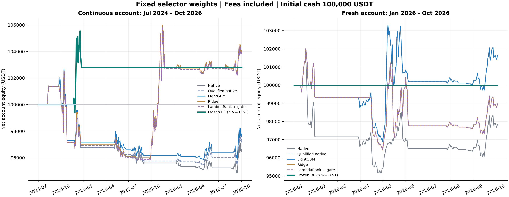

# 冻结新选币器的最新历史回测（2026-10-05）

本次在新目录重新运行原引擎，固定既有主候选 RL 和三个监督模型的权重及门槛，未训练、未搜索新参数、未按本次收益改选候选。日线已延长至 **2026-10-03**，只使用已经收盘的数据。两组账户均以 **100,000 USDT** 开始，原策略、策略健康、风险、资金分配、手续费、滑点、撮合及真实终端平仓规则保持一致。

完整评价账户从 2024-07-01 连续运行，2026 对照账户从 2026-01-01 独立初始化。连续账户逐年归因另外报告，不把独立账户结果拼接为连续收益。主候选保持源6冻结 RL，父模型为 LightGBM，概率门槛为 **0.51**。

## 2024-07-01 至 2026-10-03：连续账户

| 方案 | 期末净资产（USDT） | 净利润（USDT） | 净收益 | 年化收益 | 最大回撤 | 平均总敞口 | 成交行数 | 佣金（USDT） | 会计 |
|---|---:|---:|---:|---:|---:|---:|---:|---:|---|
| 原规则 | 96,587.78 | -3,412.22 | -3.4122% | -1.5253% | 7.6314% | 2.1010% | 116 | 190.83 | 通过 |
| 相同资格的原规则 | 97,359.05 | -2,640.95 | -2.6410% | -1.1779% | 7.0368% | 2.0897% | 110 | 185.28 | 通过 |
| LightGBM | 97,777.21 | -2,222.79 | -2.2228% | -0.9903% | 6.6376% | 2.1011% | 110 | 186.07 | 通过 |
| Ridge | 104,062.05 | +4,062.05 | +4.0620% | +1.7784% | 6.4339% | 2.0949% | 98 | 170.96 | 通过 |
| LambdaRank + 收益门槛 | 103,945.71 | +3,945.71 | +3.9457% | +1.7281% | 6.5386% | 2.0774% | 98 | 170.40 | 通过 |
| 冻结 RL 选币器 | 102,805.16 | +2,805.16 | +2.8052% | +1.2324% | 2.5961% | 0.7271% | 4 | 35.60 | 通过 |

## 2026-01-01 至 2026-10-03：独立账户

| 方案 | 期末净资产（USDT） | 净利润（USDT） | 净收益 | 年化收益 | 最大回撤 | 平均总敞口 | 成交行数 | 佣金（USDT） | 会计 |
|---|---:|---:|---:|---:|---:|---:|---:|---:|---|
| 原规则 | 97,817.12 | -2,182.88 | -2.1829% | -2.8785% | 6.2222% | 6.4607% | 44 | 134.74 | 通过 |
| 相同资格的原规则 | 101,610.92 | +1,610.92 | +1.6109% | +2.1374% | 5.0400% | 7.4323% | 54 | 141.83 | 通过 |
| LightGBM | 101,610.92 | +1,610.92 | +1.6109% | +2.1374% | 5.0400% | 7.4323% | 54 | 141.83 | 通过 |
| Ridge | 98,945.09 | -1,054.91 | -1.0549% | -1.3936% | 5.4848% | 6.3379% | 48 | 146.54 | 通过 |
| LambdaRank + 收益门槛 | 98,945.09 | -1,054.91 | -1.0549% | -1.3936% | 5.4848% | 6.3379% | 48 | 146.54 | 通过 |
| 冻结 RL 选币器 | 100,000.00 | +0.00 | +0.0000% | +0.0000% | 0.0000% | 0.0000% | 0 | 0.00 | 通过 |

## 连续账户的逐年收益

| 方案 | 2024（7–12 月） | 2025 | 2026（1 月至 10 月 3 日） |
|---|---:|---:|---:|
| 原规则 | -3.2389% | -1.1933% | +1.0265% |
| 相同资格的原规则 | -3.2389% | -1.0386% | +1.6740% |
| LightGBM | -2.8233% | -1.0386% | +1.6740% |
| Ridge | -2.9818% | +5.9787% | +1.2093% |
| LambdaRank + 收益门槛 | -3.0903% | +5.9787% | +1.2093% |
| 冻结 RL 选币器 | +2.8052% | +0.0000% | +0.0000% |

每年收益按上年最后账户净权益为分母，2024 首段以初始资金为分母；没有追加资金或重置连续账户。年化使用各区间实际日历天数和 365.25 日折算，属于短历史表现的数学折算，不是未来收益预期。净收益已包含全部实际执行成本；佣金单列用于解释费用，不再从净收益重复扣除。成交行数包括买卖和部分成交，不代表独立交易数量。

## RL 行为与结果边界

完整连续账户：收益 +2.8052%，最大回撤 2.5961%，平均敞口 0.7271%，实际成交 4 行，政策接受 2 个候选。已记录概率 361 条，概率范围 0.489229–0.510482，低于冻结门槛 359 条、达到门槛 2 条。期末实际待处理/活动订单数为 0/0；未成交订单不计为利润。

2026 独立账户：收益 +0.0000%，最大回撤 0.0000%，平均敞口 0.0000%，实际成交 0 行，政策接受 0 个候选。已记录概率 94 条，概率范围 0.489229–0.508700，低于冻结门槛 94 条、达到门槛 0 条。期末实际待处理/活动订单数为 0/0；未成交订单不计为利润。

各方案的持仓事件集中度和风险状态保留在 JSON 与逐账户证据中。现金账户的零收益、零回撤是合法执行结果，不证明模型具有盈利能力；历史收益为正也不证明独立泛化。该回测继续属于已观察历史的开发评价，完整历史 PIT 未验证，未打开 2026-10-06 开始的独立未来窗口，生产启用保持 false。

## 数据与可复核证据

保留原注册 60 币历史，给仍有真实报价的 55 币各追加 15 根日线，共 825 根。重叠 OHLCV 和真实成交额核对一致，原历史特征与资格逐项精确不变；新增数据的 478 行满足冻结输入资格。报价额直接使用交易所原始 kline 第 7 字段，原始回复、CSV、接收时间和文件身份分别保存。五个已终止资产保留原历史及退出标记，没有补造价格或成交。当前交易资格与观察到的历史不是完整历史成员 PIT。

准备阶段发现新旧可得时间序列化格式不同，修复前新增行全部误判不可用；该目录在任何回测前停止，并保存原协议、原产物和原驱动字节。随后在新目录统一时间表示、验证新增资格及所有原历史特征，才运行本次十二个实际账户。模型权重和收益门槛没有改变。

- [本次摘要](../../reports/ml_selection_fresh_backtest_20261005/summary.json)
- [独立复核](../../reports/ml_selection_fresh_backtest_20261005/independent_review.json)
- [模型与区间登记](../../reports/ml_selection_fresh_backtest_20261005/run2/fixed_model_registration.json)
- [连续账户实际收据](../../reports/ml_selection_fresh_backtest_20261005/windows/post_validation/receipt.json)
- [2026 独立账户实际收据](../../reports/ml_selection_fresh_backtest_20261005/windows/year_2026/receipt.json)
- [注册行情及数据身份](../../reports/ml_selection_fresh_backtest_20261005/input_bundle3/registration.json)
- [准备失败保留记录](../../reports/ml_selection_fresh_backtest_20261005/preparation_failure_receipt.json)
