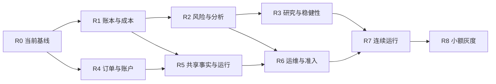

# QuantTrading 统一 Roadmap v3.0

> 公开发布视图：保留任务编号、状态、依赖及技术契约；私人邮件正文、逐条审查摘录和邮箱映射未发布。原始本地登记仍是权威资料。`reports/`、`outputs/`、`tmp/`、`docs/archive/` 及邮件审计文件均为仅本地引用，不随源码发布；公开 CI 的 structure-only 结果不代表这些历史证据已验证。

> 生效日期：2026-09-20。适用对象：QuantTradingV1 工作区 / GitHub QuantTradingV2。
> 本文件维护项目阶段、优先级、依赖和放行标准。
> 执行入口：[开发计划](development_plan.md) → [开发详情](development_details.md) → [任务登记表](development_task_registry.json)。
> 历史总入口：过去的路线图、开发计划与 Codex 邮件（仅本地引用：`docs/archive/2026-09-roadmap-rebaseline/README.md`，不随源码发布）。
> 需求追溯：[旧编号与新任务映射](roadmap_traceability.md)；基线审计：2026-09-20审计报告（仅本地引用：`docs/codex_mail_roadmap_audit_20260920.md`，不随源码发布）。

## 1. 本轮目标和当前结论

本轮目标是将已完成的基础工程收敛为可信、可复现、可恢复、可审计的系统，关闭已确认缺陷，完成当前研究交付，随后按真实证据推进连续运行。当前正式策略仍为 **paused_revalidation**，未取得真实资金放行。

新路线图同时吸收原 R0–R8、BM0–BM8、G0–G10、S0–S4、SR0–SR6、PM0–PM4、历史工程编号，以及 历史审查中的77条意见。已经实现的模块以补齐契约和验收为主；源代码存在、PR合并、邮件审查完成、研究运行完成分别记录，不直接算项目验收通过。

### 2026-09-20 实现复核

本轮已完成20个FIX、VER-01及当前源码冻结/三进程复现，补齐增量恢复、跨模式/故障证据及标准指标产物。各SYS工作包保留整体依赖与真实运行边界，R0–R8未全部放行。原始审计及研究fail结论保留。详见[执行与验收记录](r_series_acceptance_20260920.md)及机器验收索引（仅本地引用：`reports/roadmap_v3/acceptance_index.json`，不随源码发布）。

第5、6节追加实现、当前源码身份及验证见[追加执行记录](section56_acceptance_20260920.md)。九项规则已有机器验收；SYS-12/13已新增隔离工程能力但未整体关闭，SYS-11仍待未见样本，S4候选仍受前置限制。

今日文档回顾后的追加实施见[后续完成记录](followup_completion_20260920.md)：补齐账户独立来源适配与运行时新增风险门禁、分组回撤/机会成本/独立报价指标输入，以及自动回测和研究编排。新增SYS-19承接自动化方案，当前登记41项（原始40项加1项），24项历史已验收、17项开放。真实账户/数据来源、连续运行、远端CI及未来研究证据按实际状态保留；代码与本地测试完成不等于这些证据已经取得。

## 2. 统一事实基线

| 事实 | 2026-09-20 基线 |
| --- | --- |
| 源码 | HEAD `ab15bc244d54b1161a8b6714d2eb71565c2c1d41`；分支 `codex/p2-p3-signal-meta-layer`；已有未提交研究与执行改动 |
| 历史基线 | 9月6日精确提交已验收；当前工作区已另存源码、配置、输入及测试身份（本轮复核见上） |
| 邮件 | 45封项目Codex邮件、30个PR、77条意见：24已修复、7部分修复、45仍存在、1证据不足 |
| 研究运行 | 9月19日15基线+572矩阵+39验证=626次完成，另有8次跨市场研究 |
| 研究结论 | 默认策略final20收益−5.436%、事件组PF0.468；滚动4/11盈利；结果fail |
| 工程交付 | 9月19日历史交付日志1304 passed/1 skipped/46 subtests passed；总completion仍pending，元层交付未闭环 |
| 信号元层 | P0/P1已合入；P2/P3有本地工程隔离验收，未提交且不构成有效性或正式账户准入 |
| 实盘 | 未找到可核验的连续运行、完整批准与小额实盘完成证据 |

邮件77条是审查记录数量，不是77个去重根因；新执行任务在开发计划中按契约合并。原审计结论保留在历史快照中，后续任务状态变更须附新证据。

## 3. 文档与状态规则

权威层次：

1. 用户当前明确要求和已批准研究/运行契约。
2. 本总路线图：阶段、依赖、风险边界。
3. [开发计划](development_plan.md)：批次、任务状态、串并行和交付顺序；[任务登记表](development_task_registry.json)是其结构化副本。
4. [开发详情](development_details.md)：输入输出、不变量、修改范围、验收、兼容迁移。
5. 领域公式/行为契约：补充精确定义；过时排期和旧完成标记以新计划为准。
6. 历史文档与邮件：追溯依据，不独立排期。

编号规则：`R`为项目阶段；`B`为开发批次；`FIX`为邮件缺陷工作包；`SYS`为历史能力补齐；`VER`为待核实意见；`MAIL`为原始邮件意见。信号P0/P1/P2/P3是研究层级，缺陷P0/P1/P2/P3是优先级，必须注明语境。

任务状态使用“待闭环 / 部分实现待验收 / 待验证 / 待证据 / 后续扩展 / 已验收”。“已修复邮件”保留为回归登记；新组合任务不得继承其中单条意见的完成状态。每次关闭任务更新计划、登记表和验收索引，保留原基线判断。

## 4. 项目阶段与退出条件

| 阶段 | 当前状态 | 下一完成边界 | 退出证据 |
| --- | --- | --- | --- |
| R0 基线治理 | 当前源码本地冻结与三进程复现已验收 | 当前工作区身份、固定数据/配置、严格源码校验、历史迁移索引 | 三次独立固定回归一致；源码/数据/配置摘要；质量检查与差异解释 |
| R1 可信回测内核 | 部分完成 | 一套成交/lot/position事实；完整成本；资金对账；指标与JSON契约 | 现金/仓位/已实现与未实现PnL/费用/权益桥接，非法数据明确失败 |
| R2 风险与交易分析 | 基础实现完成，细项待闭环 | BM1–BM4、生命周期/漏斗、真实流动性、图表与报告一致 | 手算边界、分组对账、固定订单成本单调性、无前视 |
| R3 归因与稳健性 | 工具存在，策略准入未过 | BM5–BM8、冻结配置、未见样本、统计支持和参数稳定性 | train/validation选参隔离；最终样本单次裁决；失败和不足如实保留 |
| R4 交易所与订单 | 订单基础已实现，账户闭环待补 | 订单/成交/外部仓位/成本对账；风险动作持久目标与保护 | 超时/unknown/部分成交/缺bar/重启不重复，事实缺失阻止新风险 |
| R5 共享运行与事实 | 共享内核存在，迁移与全链路待验收 | 回测/回放/sandbox一致语义，旧事件兼容，持仓生命周期共享决策 | 同事件流signal/intent一致、事实可追溯、崩溃重放幂等 |
| R6 监控运维 | 工具已实现，准入与操作闭环待修 | 健康/对账/连续性严格门控，快照、告警、备份、回滚和演练 | 关键失败不能误通过；告警可追溯；恢复演练和运行手册可执行 |
| R7 Shadow/Sandbox/Paper | 未验收 | 冻结版本连续运行、逐笔与日终对账、执行成本校准 | 按下节严格时间门槛和全部前置证据通过；未解释P0/P1为零 |
| R8 受控灰度 | 未放行 | 单交易所/单标的/单策略小额灰度；每次只改变一个扩容维度 | 人工批准、最小权限、逐笔100%对账、急停/回滚、容量复审 |

### 阶段依赖

门控代码修复可以先行并行开发；运行放行仍遵守以上依赖。研究结论为fail时，即使工程任务完成，也不自动进入该策略的真实资金阶段。

## 5. 旧计划冲突的统一口径

2026-09-20 已将下列九项口径接入 [POL-01–09 规则契约](roadmap_policy_contract.md)及[机器验收入口](../scripts/verify_roadmap_policy.py)。本轮同时修复连续运行门槛可被降低、简略 paper 报告误通过及前瞻协议修改后未校验原哈希的问题。逐项结果见[第 5、6 节执行记录](section56_acceptance_20260920.md)；真实运行、研究有效性和工程验收分别记录。

| 冲突 | 本轮采用的规则 | 来源 |
| --- | --- | --- |
| 按OOS表现排序 vs 最终样本不参与选择 | 参数只能用train/validation选择；最终holdout单次独立评价；历史已见区间只作回顾性研究 | R3/SR5，本地审查编号已省略，FIX研究任务 |
| R7写2–4周 vs Phase6要求8–12周 | 2–4周是中间检查；真实资金准入至少56个连续自然日、至少两种市场状态，冻结协议更长则按更长；没有连续观测不得用首尾日期代替 | [Phase6 T-6.2](phase6_operations.md) |
| 老健康恢复阈值与9月14日契约不同 | 延用已批准的分级恢复、样本边界与迁移规则；本次文档整合不调阈值、不解除人工锁定 | [9月14日契约](research/strategy_remediation_contract_20260914.md)、[健康契约](strategy_health_contract.md) |
| 按成交时权益重算风险 vs 原订单批准预算 | 成交后只读不可变`approved_risk_amount`及原止损/参考价；数量精度缩小预算，权益增长或恢复不能扩大旧预算 | [保护止损契约](protective_stop_contract.md) |
| 理想止损价/立即全额强平 vs 真实跳空和流动性 | 保留真实成交价格、成本、部分成交和共享参与率；目标减仓持续至完成，不伪造流动性 | 9月14日契约，R1/R4 |
| 指标不可计算显示0/inf vs 可审计状态 | 输出null+状态+原因；明确样本不足与输入错误；兼容旧四态必须版本化 | BM0及[指标详情](backtest_metrics_detailed_development_plan.md) |
| 研究audit ledger被当作主交易账本 | 复用现有成交/lot事实，收敛权威投影；不以离线研究模块存在代替交易链路完成 | [账本边界](authoritative_ledger.md) |
| 基准等权再平衡 vs 冻结买入持有 | 两种政策使用不同benchmark_id；当前冻结研究沿用9月14日BTC/ETH各50%首开盘买入、不再平衡、上市前现金规则，不按结果换基准 | [9月14日契约](research/strategy_remediation_contract_20260914.md)、SYS-03/11 |
| Phase/T/G/BT编号重名 | 追溯键使用“原文档路径+旧ID”，保留上下文，不能按数字直接合并 | [追溯矩阵](roadmap_traceability.md) |

## 6. 策略与能力支线

- **S0/S1与SR0–SR5**：先修生命周期、数据、成本和研究口径，再形成新准入判断；不能按历史最佳收益选择修复方案。
- **S2选币**：已实现带生效/可得时间和来源摘要的PIT选择、rank/zscore、TopN缓冲、目标权重及费用/现金/换手/参与率约束提案，另有隔离Broker部分成交对账和事后研究诊断。真实全历史成员/退市数据核验、独立样本与正式路由前置仍待闭环；SYS-12为部分实现待验收。见[选币契约](s2_selection_contract.md)。
- **S3与PM1–PM4**：保证金/融资/强平已有基础；新增默认关闭的vol targeting、组合约束、不可变风险预算下的分批目标与恢复检查点。共享持仓身份及保护单迁移按专项证据验收；真实账户和独立研究依赖仍保留，SYS-13为部分实现待验收。见[仓位能力契约](s3_position_capabilities.md)。
- **P0–P3元层**：已有交付及正式账户隔离回执已补齐，本轮复核64项来源/产物摘要；工程交付pass与研究fail分别保留。随后按冻结协议积累样本；全弃权、无交易或固定25%仓位不算模型有效。
- **S4合约策略**：在工程与独立研究门槛满足后才评估具体候选；不承诺盈利或自动实盘扩容。

现有前瞻协议记录：观察窗为 **2026-10-20, 2027-04-18)**，最早成熟日 **2027-05-08**；这是既有协议边界，不是本次承诺的开发截止日。不得在成熟前打开样本选参，不得用当前回顾性结果替代。若修复改变冻结候选的代码/配置身份，先按原协议的变更规则登记影响，再建立合规的新身份和观察安排；不复用旧hash声称同一候选。见 [原协议（仅本地引用：`reports/strategy_review_20260919/prospective_protocol.json`，不随源码发布）。

本轮修复后的默认候选另行登记新身份，配置不变，S2/S3扩展仍为隔离研究能力。2026-09-20新登记的观察窗为 **2026-10-21, 2027-04-19)**、最早成熟日 **2027-05-09**；不继承原候选经过的观察天数。原协议、旧626次研究及fail结论不改写。见[新身份回执（仅本地引用：`reports/roadmap_v3/SYS-11/20260920-section56-successor-02/acceptance.json`，不随源码发布）。第6节整体仍受真实数据、独立研究和账户/运行依赖限制，不能作为真实资金放行证明。

## 7. 优先级和完成定义

今日后续账户、指标、自动化和灰度准入修复已另行登记 followup-successor-03（仅本地引用：`reports/roadmap_v3/SYS-11/20260920-followup-successor-03/acceptance.json`，不随源码发布），源码身份为 `1ed2cf91117b5de1817fe88e5b46aa19cf2acb754a2ba75412c7c2aa63085211`；观察窗仍为 **[2026-10-21, 2027-04-19)**、最早成熟日 **2027-05-09**。此前身份、旧协议和研究fail完整保留。最新工程验证与仍未完成的BX扩展详见[后续完成记录](followup_completion_20260920.md)。

2026-09-20 已将本节落实为[完成定义契约 v1](roadmap_completion_contract.md)、[版本化证据清单](roadmap_completion_manifest.json)和[机器检查入口](../scripts/verify_roadmap_completion.py)。检查覆盖优先级、依赖关闭、七项完成定义、跨文档状态及历史证据摘要；执行与限制见[第 7 节验收记录](section7_acceptance_20260920.md)。本节治理完成不代表剩余系统任务或 R0–R8 已全部验收。

| 优先级 | 判断依据 | 处理 |
| --- | --- | --- |
| P0 | 错误新增风险、重复/漏执行、预算或运行准入失效 | 阻止相关运行放行，优先独立验证 |
| P1 | 前视、账务/成本失真、研究门槛错误、事实与恢复分叉 | 正式冻结研究/长跑前关闭 |
| P2 | 诊断、图表、兼容、运维和审计完整性 | 相应依赖验收前关闭 |
| P3 | 新策略、选币/仓位能力、性能和体验扩展 | 进入独立支线，遵守工程及研究前置 |

每个任务完成须有：明确契约；与风险相称的正反例或故障测试；迁移兼容说明；固定输入及源码身份；差异/对账结果；未建模项和限制；可定位验收产物。纯文档任务使用链接、编号、覆盖和哈希校验，不要求无关交易测试。

本轮执行顺序、可并行项和逐项详情以开发计划为准。新任务先做“现状确认→最小失败样本→修复/补齐→专项验收→集成证据”，不得因整合文档把未完成项标成完成。
