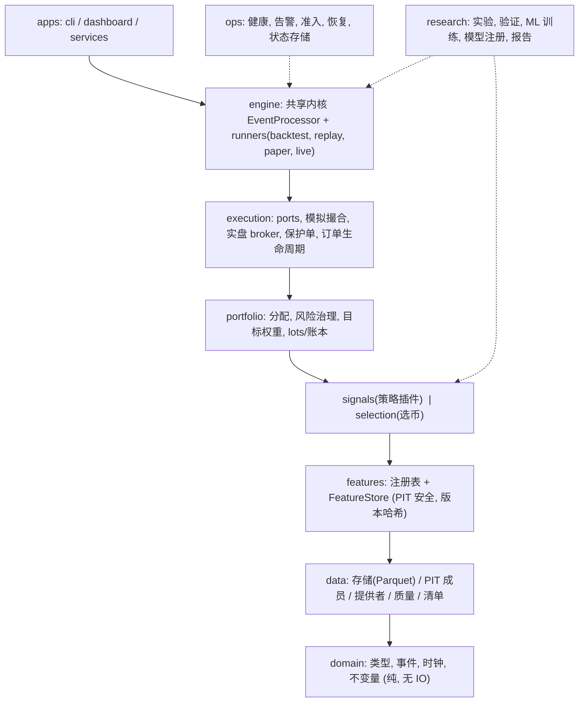

# QuantTrading V4 架构设计(提案)

日期:2026-10-10。状态:**草案(Draft),尚未登记进[统一 Roadmap](unified_roadmap.md)**,不改变任何任务状态、策略准入或实盘放行。数字目标均为待基线测量后修订的估计,不是已取得的结果。

## 0. 前置:基础设施阶段 0(进入 V4.0 之前)

V4 的搬迁与重构依赖下列工程底座;它们与本文的 V4.0 重叠的部分只做一次。

| 步骤 | 内容 | 状态(2026-10-10) |
|---|---|---|
| 0.1 卫生与护栏 | `.gitignore`/`.gitattributes` 修正;PR 模板、CODEOWNERS、SECURITY、CONTRIBUTING、Dependabot(仅 Actions) | 已合并(#54) |
| 0.2 可安装包 | `pip install -e .`、控制台入口、删除 71 处 `sys.path` 补丁、`install-smoke` CI(已设为必需检查) | 已合并(#60) |
| 0.3 质量棘轮 | ruff 分档加规则、mypy 扩围、覆盖率门槛上调、测试标记/超时、pre-commit | 未开始 |
| 0.4 依赖方向 | import-linter;消除 `core → research`、`backtest ↔ analysis/research` | 未开始(并入本文 V4.0) |
| 0.5 冻结身份解耦 | 身份绑定发布标签与证据清单;校验脚本不再写死文档路径;CI 断链检查 | 未开始 |
| 0.6 开发体验 | 统一任务入口、devcontainer、`docs/adr/`、脚本索引 | 未开始 |

建议在 0.3–0.5 完成后再开始 V4.1 之后的结构搬迁。

## 1. 为什么需要 V4

事实基线(2026-10-10 在本检出内统计):

| 观察 | 数据 | 影响 |
|---|---|---|
| `core/` 职责混杂 | 140 个文件 / 3.2 万行,根目录平铺 88 个模块;含交易所适配、`signal_*`(约 2800 行)、准入治理 | 无法按变更原因定位代码,新增策略要碰多处 |
| 三套选币实现 | `core/selection.py`(v1)、`core/selection_v2.py`、`research/ml_selection/selector.py`,另有 `backtest/coin_selector.py` 加载冻结模型 | 规则、ML、回测接入各走一套,行为难对齐 |
| 特征多处重复 | `core/factors`、`core/indicators`、策略内计算、`ml_selection/dataset.py` 的 21 个特征 | 训练/回测/实盘特征易漂移 |
| 回测引擎单体 | `BacktestEngine.run` 约 840 行(`backtest/engine.py:218-1058`);10 币×720 日约 4.1 s、1068 笔成交(2026-09-22 测量) | 难扩展新功能;逐 bar 的 Python 循环是主要吞吐上限 |
| 入口臃肿 | `main.py` 1128 行;`scripts/` 93 个文件 / 1.8 万行;`run_trend_portfolio_v2/v3` 平行存在 | 逻辑在脚本里,难复用和测试 |
| 策略层 | `strategies/base.py` 883 行基类承担信号、退出追踪、持久化、健康;`statistical_arbitrage.py` 全仓无引用(死代码) | 加策略成本高 |
| ML 样本有限 | 1077 个决策日期、20 日重叠标签;原策略真正产生横截面竞争的只有 21 个日期;RL 仅 4–5 次更新后早停,最佳验证策略保持现金 | 复杂模型(RL)在此数据量下收益不确定、验证成本高 |
| 依赖方向 | `core/events/codec.py:29` 反向导入 `research`;回测直接导入 `research.ml_selection`、`analysis` | 研究代码泄漏进交易主路径 |

V4 目标:**一套分层包、一条特征管线、一个选币协议、一个策略插件接口、两层回测**,同时保持交易语义不变(Next-Bar 撮合、已收盘 bar、UNKNOWN 禁新增风险、保护单、恢复幂等)。

非目标:不改动风控/撮合/费用语义;不因架构完成宣布策略有效或放行真实资金;不重写已验收的账务内核。

## 2. 分层与包结构

依赖只允许自上而下;由 import-linter 在 CI 强制。



规则:`domain` 不依赖任何包;`research` 可依赖下层但**没有任何包依赖 research**;`ops` 只被 `apps/engine` 调用。

```
quant/
  domain/     orders, events(含 CashEvent/MarkPriceEvent), clock, money, 不变量
  data/       store, providers(ccxt/local), pit_universe, quality, manifest
  features/   registry, store, defs/{momentum,volatility,liquidity,trend,flow,...}
  signals/    base(精简协议), registry, builtin/{trend_breakout,range_revert,...}
  selection/  universe, eligibility, scorers/{rule,ridge,lgbm,meta}, constructor
  portfolio/  allocation, governor, targets, lots, ledger
  execution/  port, sim(broker), live(broker), protective, lifecycle
  engine/     kernel(EventProcessor), runners/{backtest,replay,paper,live}
  ops/        health, alerting, admission, recovery, stores
  research/   experiments, validation, ml/{dataset,train,registry}, reporting
  apps/       cli(单入口), dashboard
```

现有目录映射:`core/{broker,live_broker,exchange}→execution+data`;`core/signal_*→signals/meta(可选扩展包)`;`core/{admission_gates,r7_acceptance,gray_release,health,alerting}→ops`;`core/selection*.py + backtest/coin_selector.py + research/ml_selection/selector.py→selection`;`router+composition→engine/wiring`。`scripts/` 缩为薄命令,逻辑下沉到库。

## 3. 特征管线(ML、策略、选币共用)

问题根源是特征分散。V4 引入单一 `FeatureStore`:

- **注册表**:每个特征 = `name + version + 依赖 + warmup + 可得时间规则(PIT)`,计算为向量化纯函数 `(OHLCV 面板) -> 列`。
- **面板式计算**:按 `[时间 × 币种]` 一次性算完整历史(NumPy/pandas 向量化),落盘为 Parquet,并以 `代码哈希+数据哈希+特征版本` 为缓存键。回测、训练、实盘增量更新用同一定义。
- **因果保证**:特征 `t` 只用 `≤t` 已收盘 bar;统一的 shift 与可得时间单测("扰动未来 bar,特征不变")替代各处自查。
- 现有 `core/factors`、`core/indicators`、ML 的 21 个特征合并入注册表;策略声明所需特征 `requires=[...]`,不再自行算指标。
- 新增候选特征(需先通过 IC 检验再入模):横截面排名/z-score、BTC 相对强度、市场广度(上涨币占比)、波动率状态、资金费率/持仓量(`core/derivatives_data.py` 已有数据入口)。

预期收益:消除训练/回测/实盘漂移;回测不再在每根 bar 重算指标(性能见第 7 节)。

## 4. 选币器:统一协议

四种实现收敛为一条流水线:

```
Universe(PIT成员) → Eligibility(流动性/上市/健康) → Scorer → Constructor(TopN+缓冲+约束) → TargetIntents
```

- `Scorer` 为可插拔协议:`score(features_at_t) -> Series`。内置:`RuleScorer`(现 v2 规则)、`RidgeScorer`、`LGBMRankScorer`、`MetaFilter`(见 5.3)。
- `Constructor` 把现 `selection_v2.size_portfolio_targets`、TopN 缓冲、换手/参与率/成本约束并入同一处;输出统一 `TargetIntents`,下游分配器与风控不变。
- 回测、纸面、实盘用同一 `Selector` 对象;`candidate_selector` hook 保留默认关闭,改为 `Selector` 实例。
- 每次决策写 **决策审计**(入选原因、分数、被拒原因、模型/特征/成员身份哈希)。现有"漏斗"诊断沿用。
- 评估内置:同批次与原规则 **配对 A/B**(已有回测开关扩展为一等功能),输出 rank-IC、分位收益价差、Top-N 换手与容量。

## 5. ML 优化

### 5.1 判断
V1 的证据说明瓶颈在**样本结构与目标设定**,而不在模型复杂度:独立竞争日期仅 21–60、标签重叠、RL 更新次数少、门槛 `p≥0.5` 使全部拒绝。因此 V4 把 ML 投入从 RL 转向更稳健、样本效率更高的监督方法。RL 代码归档到 `research/archive`,保留可复现性,不再进入主线。

### 5.2 方案
1. **标签对齐真实退出**:用 triple-barrier(止盈/止损/时限)与原策略的 ATR 止损和保护止损规则一致的标签,替代 20 日固定窗口代理标签;V1 已验证"退出干预契约",在此基础上落地。
2. **样本权重与去重叠**:按标签重叠度计算唯一性权重(de Prado 方法),训练与评估使用 purged + embargo 时间交叉验证,整体用 CPCV 估计性能分布而非单一路径。
3. **主指标改为排序质量**:rank-IC / ICIR、Top-N 分位价差、净收益(含成本);组合收益作为终验而非调参目标。
4. **先线性、后树、再集成**:Ridge/Elastic-Net 为基线;LightGBM LambdaRank 作挑战者;最后 shrinkage 集成。必须击败"原规则"和"线性基线"才允许升级。
5. **元标签(Meta-labeling)**:对策略已产生的候选做"做/不做"的二分类并校准概率,与 `core/signal_meta_layer` 合并为同一机制,避免两套元层。
6. **模型注册表**:每个模型有 model card(训练数据哈希、特征版本、CV 结果、适用账户模式)、状态机 `candidate → shadow → champion → retired`。
7. **线上监控**:特征漂移(PSI)、IC 衰减、预测分布;触发降级回规则选币(安全回退)。
8. **推理轻量化**:冻结模型导出为纯 NumPy/树文本,实盘不依赖训练栈;LightGBM 仅在 `research` 的可选依赖里。

### 5.3 准入
沿用现有规则:参数只用 train/validation 选择;最终样本单次裁决;前向观察窗与成熟日不变。V1 的 `formal_admission=false` 在 V4 模型取得独立证据前保持不变。

## 6. 策略层与新增策略

### 6.1 精简接口
现 `Strategy` 基类 883 行。V4 拆为:

- **`SignalStrategy` 协议**(策略作者只写这个):
  `spec`(id、版本、参数 schema、`requires` 特征、warmup、适用 regime)+ `generate(ctx) -> list[EntryIntent | ExitIntent]`。纯函数,无持久化、无副作用。
- **框架负责**:退出追踪、批次对账、状态检查点、健康乘数、入场风险预算、保护止损——由 `engine` 的通用组件处理,而不是每个策略继承。
- 注册靠装饰器 `@register_strategy`,`config` 里声明启用列表;`router` 的 regime→策略映射改为数据配置。
- 合并 `trend_portfolio_v2/v3` 为一个带参数的 `TrendPortfolio`(权重周期、再平衡规则为参数);删除无引用的 `statistical_arbitrage.py` 或将其作为 `pairs` 策略正式化。

### 6.2 新增策略路线(全部按"研究 → 隔离回测 → 前向观察"流程,不自动启用)

| 策略族 | 思路 | 数据/账户要求 | 备注 |
|---|---|---|---|
| 横截面动量/相对强度轮动 | 周频按风险调整动量排序,持有 TopN,缓冲降换手 | 现货多头 | 与选币器共用 `Scorer`,是 V4 的第一个"选币即策略" |
| 低波/风险平价防御 | 逆波动率加权 + BTC 趋势过滤,熊市转现金 | 现货 | 作为组合底仓,降低回撤 |
| 波动率收缩突破(Squeeze) | Bollinger 在 Keltner 内收缩后突破,ATR 止损 | 现货 | 与现有 TrendBreakout 低相关性需验证 |
| 超跌反转(带市场过滤) | 大市值币短期超跌 + 市场广度未崩溃时均值回归 | 现货 | 与现有 `RangeStrategy` 区别于横截面 |
| 配对/统计套利 | BTC–ETH 等协整对的价差回归 | 需融资/做空(margin/perp) | 现存 `PairsTradingModel` 可作起点,账户模式需单独验收 |
| 资金费率/基差 carry | 永续资金费率为正时做多现货+做空永续(delta 中性) | 衍生品账户 | 数据入口已有,实盘风险(保证金、强平)最高,放最后 |
| 策略间配置(meta-allocation) | 按 regime/近期健康在策略间分配风险预算 | — | 取代手写 router 映射;预算受组合风险治理器约束 |

**重要约束**:当前正式策略仍为 `paused_revalidation`,已有 626 次研究运行。新增策略会放大**多重检验**问题,所以必须配套第 7 节的 Deflated Sharpe / PBO 检验和策略登记表(每个候选、每次试验次数都记录),否则"找到一个好看的回测"没有证据价值。

## 7. 回测:高性能与新增功能

### 7.1 两层回测
- **L1 快速筛选(向量化)**:基于 FeatureStore 面板与信号矩阵,用简化成本模型(费用+固定滑点)批量计算,用于参数扫描、选币器筛选、CPCV。目标:相对 L2 在同样本上快一个数量级以上(**待基准测量**)。
- **L2 精确回测(事件驱动)**:现有 `EventProcessor` 路径,Next-Bar 撮合、部分成交、保护止损、融资/保证金、对账。作为唯一"可信结果"。
- **一致性契约**:每个策略必须提供 L1/L2 等价测试——同一输入下交易日期一致、权益差在登记容差内;L1 不达标就不能作为筛选依据。

### 7.2 L2 性能
先 profile 再改(沿用 `scripts/benchmark_backtest.py`、cProfile),优先级顺序:
1. 指标不再逐 bar 重算:使用 FeatureStore 预计算,引擎按索引取值(预期最大收益)。
2. 数据用列式数组(NumPy)传递,避免每 bar 切片/拷贝 DataFrame。
3. `run` 拆成流水线阶段(取数据→市场状态→信号→选币→分配→风控→撮合→记账→审计),每阶段独立可测、可单独计时。
4. 多任务并行:矩阵/滚动窗口/参数扫描按进程并行,输入用只读共享内存或 Parquet 内存映射。
5. 结果缓存:键 = 代码哈希 + 配置哈希 + 数据哈希,命中直接复用。
全程保持:固定引擎基线(2,453 日 / 664 笔 / 逐日权益差 0)作为"黄金回归",任何优化必须字节级一致或登记容差内。

### 7.3 新增回测功能
1. **统一 `Experiment` 规格**:一个 YAML/JSON 描述数据、策略、选币器、成本、窗口、种子;一次产出完整证据包。
2. **验证套件**:Walk-forward、CPCV、参数稳定性曲面、Deflated Sharpe、PBO(回测过拟合概率)、试验计数登记。
3. **蒙特卡洛**:交易 bootstrap、块 bootstrap 权益路径,输出回撤/破产概率分布。
4. **成本与容量**:平方根冲击模型、参与率上限、容量曲线;与已有 `capacity`、执行校准衔接。
5. **压力场景**:闪崩、交易所停摆/缺 bar、退市、费率跳变,走相同 L2 路径。
6. **多策略归因**:按策略、币种、regime、选币器(开/关)分解收益与回撤;选币 A/B 配对报告。
7. **报告即数据**:规范产物为 JSON(带 schema 版本),Excel/HTML/图表为派生渲染器,可单独重绘,不影响指标。

## 8. 代码精简目标(待基线测量)

| 项 | 现状 | V4 目标 |
|---|---|---|
| `main.py` | 1128 行 | < 200 行,仅调用 `apps.cli` |
| `scripts/` | 93 文件 / 1.8 万行 | 约 20 个薄命令;一次性研究脚本移入 `research/` 或 `archive/` |
| `core/` 根目录平铺 | 88 模块 | 0(全部归入分层包) |
| `BacktestEngine.run` | ~840 行单方法 | 每阶段 < 100 行 |
| 选币实现 | 4 套 | 1 套协议 + 3 个 Scorer |
| `Strategy` 基类 | 883 行 | 策略作者面向的协议 < 100 行;通用逻辑下沉到框架 |
| mixin 复用实例状态 | Broker/LiveBroker/RiskManager/LiveTradingEngine | 组合 + 显式状态所有者 |
| 死代码/重复 | `statistical_arbitrage`、v2/v3 并存、`research/*.png` | 删除或正式化 |

精简方式:**先搬迁后精简**。搬迁 PR 只改包路径并保留 re-export(一个版本周期);精简 PR 只在有黄金回归保护的前提下合并重复逻辑。

## 9. 实施路线

| 阶段 | 内容 | 验收门槛 |
|---|---|---|
| V4.0 基线与护栏 | 固化黄金回归(基线+事件 fixture);事件类型移入 `domain`,消除 `core→research`;import-linter 入 CI;数据清单覆盖 31 个 CSV;CI 从锁文件安装 | 干净检出可复现;分层检查拒绝反向导入 |
| V4.1 FeatureStore | 统一特征注册表和面板缓存;ML 数据集、策略、选币器改读同一特征 | 同输入下新旧特征逐值一致;因果扰动测试通过 |
| V4.2 选币统一 | `Selector` 协议;规则/Ridge/LGBM 作为 Scorer;回测 A/B | 旧选币结果位级复现;ML 基线(2,453 日/664 笔)不变 |
| V4.3 回测 L1/L2 | 引擎流水线化、预计算特征接入、并行与缓存、`Experiment` 规格、验证套件 | L2 与黄金回归一致;L1/L2 等价测试;耗时对比有配对测量 |
| V4.4 策略框架 | 精简协议、框架接管通用逻辑、合并 v2/v3、迁移现有策略 | 迁移前后同输入交易/权益一致 |
| V4.5 新策略与 ML v2 | 逐个加入新策略;ML 标签/CV/注册表/元标签;全部走独立验证与前向观察 | 各自满足准入规则;多重检验登记齐全 |

顺序依据:先护栏和基线,再统一特征(收益最大、风险最低),然后才动引擎与策略。新策略和 ML 放最后,因为它们的有效性取决于前面提供的可信回测与特征。

## 10. 风险与取舍

- **冻结身份**:前向观察窗 [2026-10-21, 2027-04-19)。搬迁若改变冻结候选的代码或配置身份,须按原协议登记新身份。V4.0 先确认冻结范围涉及的模块,这些模块的搬迁放在观察窗之外,或使用保持哈希的 re-export 方案(需验证)。
- **L1 与 L2 偏差**:向量化回测易引入前视或成本偏差;以等价测试和"L2 为唯一终验"约束。
- **搬迁工作量**:包路径变化影响 245 个测试文件;用 re-export 和脚本化重写 import 降低一次性风险。
- **新策略的虚假发现**:见 6.2 的多重检验约束;宁可少上策略。
- **衍生品策略**(配对、carry)涉及保证金与强平,账户模式和风控契约需要单独设计与验收,不并入 V4 首批。
- 本文只覆盖设计;未做逐模块耦合扫描,V4.0 须先生成依赖图并修订包映射。
