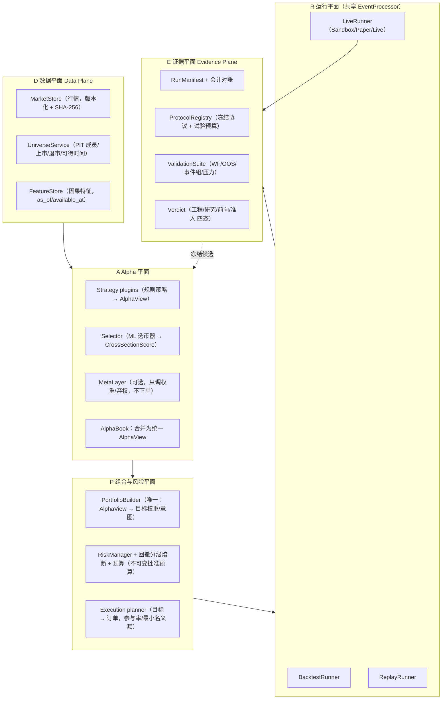
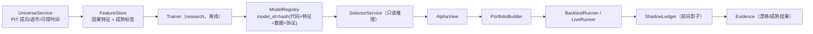
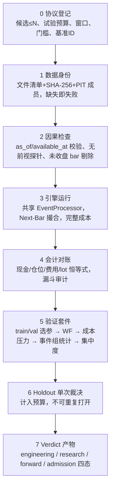

# V4 整体架构设计：分层内核、ML 选币器、策略平面与可裁决的回测流程

日期：2026-10-10。状态：**设计提案，未实施**。本文不改变统一 Roadmap 的阶段、任务状态或策略放行状态（正式策略仍为 `paused_revalidation`，ML 选币 `formal_admission=false`、`production_enabled=false`）。实施后的任务应登记到[开发计划](development_plan.md)和任务登记表，再引用本文。

“V4”在仓库里没有既有定义，这里指**在 V1 工程体系（README 自称）之上的下一代架构整理**，同时覆盖 ML 选币器（V1/V3 实验批次之后）。

## 1. 为什么需要 V4：现状的四个结构性问题

| # | 问题 | 现状证据 |
|---|---|---|
| 1 | **信号、选币、资金分配是三套并行机制** | 路由器按 regime 出候选 → `PortfolioSignalAllocator` 分配；ML 选币是 `candidate_selector` 旁路 hook，且 `validate_selector_execution_path` 拒绝它与目标权重控制器（S2/S3）同时使用；hook 仅支持 `1d`。 |
| 2 | **研究代码与内核边界不清** | `core/` 88 个顶层模块；`core/events/codec.py:29` 反向导入 `research.audit.ledger`；`backtest/coin_selector.py` 导入 research。 |
| 3 | **回测产出“数字”，而不是“裁决”** | 工程验收（会计、复现）与研究裁决（是否有 edge）分散在 `analysis/*`、`scripts/*`、各类 acceptance json 中；历史 test 被多次查看后只能当开发材料；多重试验口径靠文档约定而非代码强制。 |
| 4 | **证据显示瓶颈不在模型容量** | 默认策略 final20 收益 −5.4%、事件组 PF 0.468；ML 9 条学习曲线显示增加训练量未一致改善验证；RL 最佳验证策略多为现金；37 个 test arm 的事件独立性全部不足。 |

**V4 的设计结论**：架构投入应优先放在*让证据可信、让接口统一、让研究可安全接入*，而不是增加模型复杂度。

## 2. 设计原则

1. **一个决策契约**：所有 alpha 来源（规则策略、ML 评分、元层）都输出同一种东西——带时间戳和来源的 `AlphaView`；资金如何分配只由一个组合构建器决定。
2. **内核不认识研究**：依赖方向由工具强制，`domain ← engine ← adapters ← apps`，`research` 只能依赖 `domain` 契约。
3. **时点因果优先**：每个输入带 `as_of`（决策时点）与 `available_at`（可得时点）；违反则硬失败，不降级。
4. **证据分层、不可互相替代**：工程通过 ≠ 研究有效 ≠ 前向验证 ≠ 实盘准入，各自独立产物与状态。
5. **预算与试验次数是一等公民**：每次触碰 holdout 都消耗登记过的预算，由代码计数。
6. **生产路径默认保守**：新能力默认关闭，经 shadow → paper → 灰度，与现有 R7/R8 门槛对接，不绕过。

## 3. 总体架构



与现状的对应关系：D 平面把 `DataFetcher`、`core/universe.py`、`research/ml_selection/dataset.py` 里分散的 PIT/特征逻辑收拢；A 平面把 `strategies/`、`router/`、`research/ml_selection/selector.py`、`core/signal_meta_layer.py` 统一接口；P 平面对应 `core/allocation.py`、`core/portfolio_target_controller.py`、`core/risk/`；E 平面把 `core/reproducibility.py`、`analysis/research_validation.py`、`research_evidence.py`、`admission_gates.py` 串成固定流水线。

### 3.1 包结构（目标，旧路径保留 shim 与弃用期）

```text
quant/
├── domain/        # 纯类型与规则：Bar, AlphaView, TargetWeight, Order, Fill, Event, 账户契约
├── data/          # MarketStore, UniverseService, FeatureStore, 数据身份清单
├── alpha/
│   ├── strategies/   # 规则策略插件
│   ├── selectors/    # Selector 协议 + 适配器（加载冻结模型）
│   └── meta/         # 元层（opt-in）
├── portfolio/     # PortfolioBuilder, 预算, 目标权重, 执行计划
├── risk/          # 风控与熔断
├── engine/        # EventProcessor（共享单 bar 内核）
├── adapters/      # 行情适配、Broker 模拟、CCXT 实盘、存储(SQLite)
├── evidence/      # manifest, protocol, validation, verdict
├── apps/          # backtest CLI, live, dashboard
└── research/      # 训练、实验（可依赖 domain/data，不得被 engine/portfolio/risk 导入）
```

导入规则（import-linter 或 AST 检查，进 CI）：
`research → {domain,data,alpha 契约}`；`engine/portfolio/risk → domain`；`apps → 一切`；**禁止 `domain|engine|portfolio|risk|adapters → research`**。

## 4. 统一的核心契约

```python
@dataclass(frozen=True)
class AlphaView:                      # 每个 as_of 一份、每个来源一份
    as_of: Timestamp                  # 决策时点（已收盘 bar 的收盘时间）
    available_at: Timestamp           # 必须 <= as_of 对应的执行时点，否则拒绝
    source_id: str                    # strategy / selector 的模型或配置身份哈希
    scores: Mapping[Symbol, ScoreCell]  # 见下
    abstain: bool = False             # 允许合法弃权（空仓/现金）

@dataclass(frozen=True)
class ScoreCell:
    direction: Literal["long","flat","exit"]   # 规则策略：入场/持有/退出意图
    rank_score: float | None          # 仅表示相对次序，不含概率语义
    expected_net_return: float | None # 可选；单独校准
    horizon_bars: int | None          # 标签/持有期对应的时间尺度
    stop: StopSpec | None             # 规则策略的止损/批准预算依据
    reasons: tuple[str, ...]          # 拒绝/弃权原因，进入漏斗审计
```

要点：
- **规则策略**不再直接产生订单。它产生 `AlphaView`（含入场意图、止损、风险预算依据），仍保留 `Strategy` 基类中的硬止损、健康度、成交消费。
- **ML 选币器**产生 `rank_score` 与可选 `expected_net_return`；**不返回“盈利概率”**（沿用现有 `policy_action_acceptance_probability_not_profit_probability` 语义，把它隔离在 `reasons/diagnostics`，不进 `ScoreCell` 主字段）。
- **PortfolioBuilder** 是唯一把 `AlphaView` 变成目标权重/订单意图的地方：同一时间戳所有来源合并 → 资格过滤 → 排序 → 预算（组合敞口、相关簇、单标的上限、参与率）→ 目标。现有 `PortfolioSignalAllocator`（score→strategy→symbol 稳定顺序）成为它的“事件型入场”实现，`portfolio_target_controller` 成为“目标权重”实现；二者共用同一输入契约，**去掉 selector 与目标权重互斥的限制**。
- **候选漏斗审计**（历史成员 → 数据合格 → 原策略信号 → 模型入选 → 排序 → 资金计划 → 风控批准 → 挂单 → 成交 → 持仓 → 退出）由 PortfolioBuilder 统一写出，替代各处单独加装饰，解决“旧运行缺失上游归因”的问题。

## 5. ML 选币器 V4

### 5.1 定位

选币器是**横截面评分与资格服务**，不是独立交易系统。它回答：“在同一 `as_of`，可交易候选集合里，谁更值得占用有限预算？”它只在**确实存在资金竞争**时有可测价值（当前证据：验证期仅约 21 个竞争日期）。

### 5.2 模块与数据流



- **FeatureStore**：特征表主键 `(symbol, as_of)`，列元数据声明 `available_at` 与窗口；训练、回测、实盘**共用同一特征函数**（现状：回测从自己的 K 线重建特征，训练另有 dataset 路径，二者需统一并以 hash 校验等价）。
- **标签**：把代理标签（固定窗口/ATR）与“与原策略退出一致的真实标签”并列登记；订单未成交、资金不足、策略没买**不得写成净收益 0**，而是资格/缺失/执行标签。
- **模型族（按证据排序，非按复杂度）**：
  1. 基线：动量 / 原评分 / 随机（同候选、同账户、同预算对照，必须始终运行）。
  2. Ridge / LightGBM 回归 / LambdaRank + 训练期独立收益 gate。
  3. RL 策略（仅在上述有稳定增益、且存在资金竞争时才扩大；现有证据下**暂停新增训练预算**）。
- **ModelRegistry**：冻结包 `frozen-coin-selector/v2`，含 `account_contract`（spot/spot_margin）、`timeframe`（取消“仅 1d”硬限制，周期写进契约并校验特征一致）、特征 schema hash、训练数据清单、协议 ID、父模型。加载时校验文件 hash、身份与账户兼容（沿用 `read_bundle` 现有校验并扩展）。
- **SelectorService 接口**（放在 `alpha/selectors`，研究侧实现）：

```python
class Selector(Protocol):
    selector_id: str
    def select(self, as_of: Timestamp, candidates: Sequence[Candidate],
               account: AccountSnapshot) -> AlphaView: ...
```
  只读、无副作用；回测与实盘注入同一实现。`candidate_selector` hook 迁为该协议的适配器。

### 5.3 准入阶梯（每级独立产物，不可跳级）

| 级别 | 条件 | 现状 |
|---|---|---|
| L0 工程完成 | 契约、复现、会计通过 | 已达到（source6） |
| L1 开发有效 | 对基线在**同候选/同预算**下有正的配对增益，且事件组统计支持 | **未达到** |
| L2 PIT 复核 | 含退市/后消失资产的完整历史成员，扩展前后口径对照 | 未完成 |
| L3 前向影子 | ≥30 个真实决策日期，成熟结果与漂移记录 | 0/30 |
| L4 独立 final | 预登记区间 2026-10-06～2027-01-01，单次打开，最大候选 1 | 未打开 |
| L5 纸面/灰度 | 走 R7/R8 | 未放行 |

**V4 对 ML 的明确改动**：停止在静态 60 币上继续扩大 RL 预算；先完成 L2（PIT 成员）与 L3（前向影子），在此之前选币器只能以 `shadow` 模式运行（输出 AlphaView 但 PortfolioBuilder 不采纳）。

## 6. 交易策略平面 V4

### 6.1 现状判断

- 规则策略组合（TrendBreakout 等）经多轮复验**不具备可证明的 edge**；`TrendBreakout: paused_revalidation`，`run_live.py --live` 拒绝路由未准入策略（`core/strategy_governance.py`）。V4 不改变这一状态。
- 现有 regime → strategy 路由是合理的结构，但 regime 判定（SMA/ADX/ATR）仍是手工规则。

### 6.2 设计

1. **策略插件契约**：`Strategy.propose(view: MarketView, ctx) -> AlphaView`（入场/退出意图 + 止损 + 风险预算依据）。持仓管理（保护单、分批退出）保持在共享内核，策略不直接碰 broker。
2. **策略注册表**：每个策略有 `governance_state`（`research | shadow | admitted | paused_revalidation`），状态变更必须引用 Verdict 产物 ID，不能手改 yaml 放行。
3. **新策略候选的接入顺序**（沿用已有 S0–S4，不新增承诺）：
   - 先做**组合级基线**：BTC/ETH 买入持有（已有冻结基准）、等权再平衡、简单趋势/动量 overlay，作为所有候选必须击败的“便宜基线”。
   - 候选只有在**事件组口径**下 PF 下界 > 1 且扣费后超额为正，才进入 shadow。
   - 合约（S4）继续要求工程与研究前置满足后才评估。
4. **元层（P0–P3 信号元层）**保持 opt-in，只能调整权重/弃权，不新增下单路径；全弃权、无交易、固定 25% 仓位不算有效。
5. **Regime 作为特征而非路由开关的可选实验**：把 regime 状态作为 AlphaView 的上下文特征，而非硬路由；该实验走完整 ProtocolRegistry，不默认启用。

## 7. 回测与研究流程 V4（核心改进）

### 7.1 从“跑回测”到“可裁决流水线”



### 7.2 具体改进项

| 编号 | 改进 | 说明与验收 |
|---|---|---|
| B1 | **ProtocolRegistry 代码化** | 协议是带 hash 的 JSON：候选集合、特征/模型/数据身份、窗口、门槛、基准、试验预算。`holdout.open()` 由代码扣减预算，超预算或协议 hash 变化即拒绝；取代“靠文档约定”。 |
| B2 | **事件组为统计单位** | PF、bootstrap、置信区间一律在退出 cohort / 趋势 episode / block 上计算；报告同时给出原始行数与独立事件数；独立事件不足 → `insufficient`，不得写 pass。 |
| B3 | **配对对照常驻** | 任何候选（含 ML）自动与“便宜基线 + 同候选同预算原策略 + 随机种子”同批次运行，输出配对差异及置信区间；无资金竞争的批次不计入选币价值。 |
| B4 | **因果性探针** | 对每个特征/信号：把未来数据置乱或平移，要求结果显著退化（探针失败则判泄漏）；`available_at > 执行时点` 硬失败。 |
| B5 | **成本与执行压力标准化** | 费用 1×/1.5×/2×、延迟、低参与率、期末流动性退出失败；不可完成的情形指标为 `null+状态`，不以 0 填充。 |
| B6 | **多周期/多频支持** | 取消选币 hook 的 `1d` 限制：特征与标签带 `timeframe` 契约，回测、特征、模型三方校验一致。 |
| B7 | **回测—回放—影子一致性门禁** | 同一份 bar 流经 Backtest/Replay/Sandbox，比较 signal/intent 逐事件一致（落实 SYS-06）；不一致即 CI 失败。 |
| B8 | **产物与状态单一事实源** | 机器可读 `verdict.json` 为唯一状态来源，README/路线图状态表由脚本生成；历史归档只读。 |
| B9 | **性能** | 沿用现有 kline-mode / 事件性能路线；先加基线基准测试，再优化；任何优化需“逐日权益差 0”。 |
| B10 | **报告分层** | 报告首页只给 Verdict 四态和三个数字（独立事件数、配对超额及区间、成本 2× 后符号），详细指标下钻；避免再出现“收益很高但事件仅 2 个”的误读。 |

### 7.3 Verdict 四态定义

```json
{
  "engineering": "pass|fail",
  "research": "pass|fail|insufficient|pending",
  "forward":  "pass|fail|insufficient|pending",
  "admission": "none|shadow|paper|gray",
  "evidence": ["manifest_sha", "protocol_sha", "report_sha"]
}
```

规则：`research=pass` 需要 B2/B3/B5/B6 全满足且 holdout 单次；`admission` 只能由人工批准 + R7/R8 证据推进，Verdict 本身不能放行。

## 8. 共享运行时与实盘（保持保守）

- **EventProcessor 保持唯一决策内核**；回测/实盘的生命周期差异收敛到 Runner 层。
- **引擎去 mixin**：把 `backtest/engine.py`（1296 行）与 `live_trading/tick_orchestrator.py`（1040 行）按职责拆成显式协作对象（EquityBookkeeper、ProtectionReconciler、StateExporter、RecoveryManager），逐次拆分，每次以固定基线与故障注入回归。
- **新增风险门禁**不变：UNKNOWN 订单、账户事实缺失、对账失败、策略健康暂停 → 禁止新增风险，保护单与退出继续。
- Selector/AlphaView 在实盘中**默认 shadow**，只有 Verdict `admission ≥ paper` 且人工批准后才被 PortfolioBuilder 采纳。

## 9. 迁移路线（每步独立 PR，行为不变优先）

| 阶段 | 内容 | 验收 |
|---|---|---|
| M0 | 导入规则 + 修复 core→research 反向依赖（事件类型移入 `domain`，保留 `core.ledger:*` 旧名解码） | 旧事件 fixture 编解码一致；CI 拒绝违规导入 |
| M1 | 数据身份：30 个 CSV 全清单+哈希；UniverseService 统一 PIT | 缺失/替换即失败 |
| M2 | 定义 `AlphaView` / `Selector` / `PortfolioBuilder` 接口；现有 allocator 与 target controller 适配到同一输入；selector hook 改适配器；解除互斥与 1d 限制 | 固定回测基线逐日权益差 0；selector 关闭时无差异 |
| M3 | ProtocolRegistry + Verdict + B2–B5（事件组、配对对照、因果探针、压力标准化） | 对历史 ML/策略结果重算：独立性不足的仍判 insufficient |
| M4 | 引擎拆分 + B7 一致性门禁 | 回测/回放/sandbox 同流 signal/intent 一致 |
| M5 | FeatureStore 统一训练/回测/实盘特征；ModelRegistry v2 | 三路径特征 hash 等价 |
| M6 | 前向影子 ≥30 日期；PIT 扩展；L1 复核 | 按 §5.3 阶梯逐级报告 |
| M7 | 重绘架构图（由依赖图生成）、文档状态由 verdict 生成 | 图与代码 import 图一致 |

M0、M1、工具链收紧（ruff 规则扩充、mypy 对 core 开启跨模块检查、CI 从 lock 安装）可并行。

## 10. 非目标与风险

**非目标**
- 不承诺盈利，不改变任何策略放行或风控语义；
- 不在静态 60 币上继续扩大 RL；
- 不重写交易路径；不引入新的外部服务依赖。

**主要风险与缓解**

| 风险 | 缓解 |
|---|---|
| 接口统一导致行为漂移 | M2 前先冻结基线；每步“逐日权益差 0”+故障注入 |
| 试验预算由代码强制后历史研究被重新定性 | 旧结果保留原状态，仅新协议适用；不改写历史 |
| 样本天然稀缺（加密日线、相关币种） | 接受结论为 `insufficient`；用前向影子积累而非回测重放 |
| 重构周期过长挤占研究 | 严格小 PR；M0/M1/工具链先行，收益立刻可见 |

## 11. 待你决策的问题

1. 包名与目录是否按 §3.1 一次性迁移，还是仅先建立 `domain/` 契约包、旧目录用 shim 渐进迁移（建议后者）。
2. ML 选币在 L2/L3 完成前是否接受“仅 shadow”的约束（建议接受）。
3. 是否把 B1（ProtocolRegistry 代码化）排在 M2 之前（它不改交易路径，风险最低，收益最高）。
